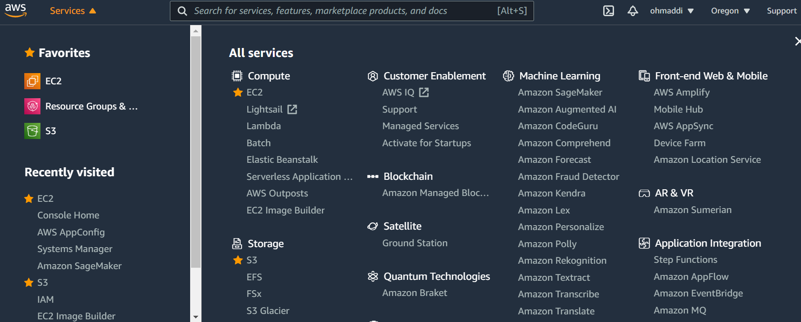
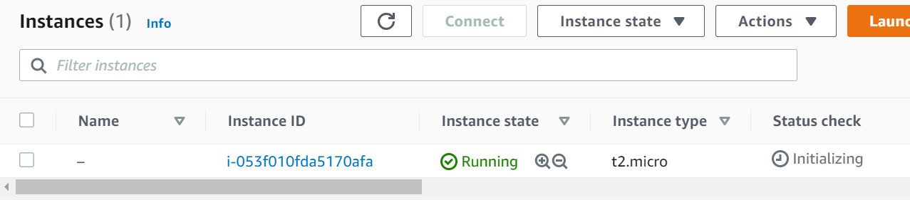
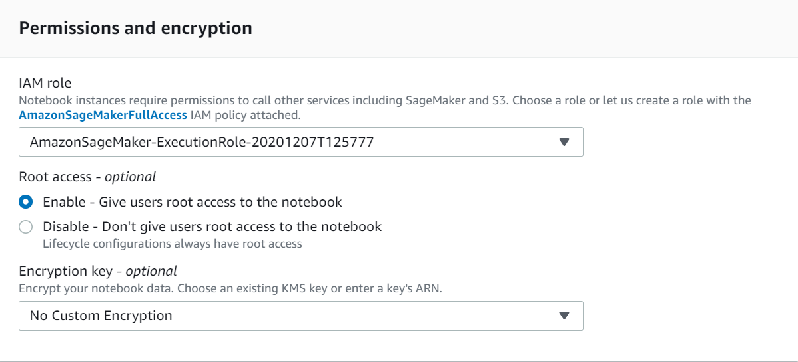

# Cloud computing

As we progress on this book our workloads are becoming increasingly resource intensive and we start wishing we had a more powerful computer. The necessity to move from a local compute environment to scaleable, fully managed cloud services becomes salient for speed and efficiency purposes. Cloud computing helps us ramp up the RAM on the virtual machine instance. Plus, cloud has much better bandwidth speed making package installation, data analyses, and data transfer much faster on the cloud. But, before you move your work to the cloud, you should first check in your institution or organization has its own servers/super computer. In this case, you most probably don't need to go cloud. For example, at the University of Oregon, we often use our supercomputer Talapas for any resource intensive job. Otherwise, going clound is the solution to access the resources you need. 

Unfortunately, R does not currently have many tools for engaging in cloud computing. There are many tools for extracting data from the cloud, but there are not many tools for connecting a local R instance to cloud-based services. Thankfully, we have people in the R community like [the cloudyr project](https://cloudyr.github.io/) and [Louis Aslett](https://www.louisaslett.com/) who are putting efforts into making this better by developing packages and platforms that would allow R users to go on the cloud in few steps. 

There are many cloud services such as Amazon, Google and Microsoft, cloud. In this chapter, we will focus on [Amazon Web Services](https://aws.amazon.com/)(AWS) as most of the space is dominated by Amazon Web Services. AWS can be a bit complicated but super useful once you get to understand it. 

First you need to create an Amazon account by simply folllowing the steps in this [guide](https://aws.amazon.com/premiumsupport/knowledge-center/create-and-activate-aws-account/)

Amazon has a free tier that enables you to try out the Amazon cloud for free for 1 year. However this is only for micro instances which have very small RAM and very small disk space. For higher RAM and higher storage you need to pay more. To look at the various instances and their per hour pricing you can see visit [here](https://www.ec2instances.info/). Basically fees are charged in compute units but the EC2 info website makes it easy to figure out costs.  

:::dictionary

:::title
Amazon Specific Terminology
:::

**EC2**: “Elastic Compute Cloud”. The framework for running your cloud machines. This is the main service for our purposes.

**S3**: “Simple Storage Service”. A central data storage framework. You simply connect your S3 to your EC2 if you want all your cloud machines to read and write to a single cloud storage.

**AMI**: “Amazon Machine Image”: A snapshot of your machines’ configurations for backup and reuse on other machines.

**IAM**: Identity and Access Management is essential to cloud security as it provides the right users, the right access, to the right resources. 

**IAM roles**: They are designed for delegating access to both humans and applications to provide only short-term credentials (36 hours max).  This is basically how you connect your EC2 instance your S3 bucket. You IAM role basically says: I want my EC2 instance to perform actions on S3 on my behalf. 

**IAM vs Roote User**: the root user is the all powerful and all knowing identity within your AWS account. If someone gets a hold of that, they can access every single thing in your account, including your personal and billing information. That said, in an individual account roote user works fine but if you are working in a team, better to use IAM. 

**VPC**: Virtual Private Cloud. We won't go thrugh this since we are not working with any sensitive data. For sensitive data, consider hiding your cluster behind a Virtual Private Cloud, which will block all the machines from the internet.

:::

Once you are done creating your AWS account and familiarise yourself with the terminology, follow the steps below to create a cloud instance on AWS.

## Compute:EC2 instance

Just about anything you can do on a server, you would be able to do it on an EC2 instance. You are basically, provisioning servers on demand. Also, similar to traditional on-premises servers, you have many customization options with EC2 instances. You can choose your favorite operating system, whether it's Windows or Linux. The right network connectivity for your servers. If you need your server to be public or private, and how much storage you need. You can also choose from a wide variety of different types of EC2 instances that are tailored to your use case. Whether you need just a general purpose EC2 instance or a server that's optimized for compute, memory, storage, graphics, and more (e.g. a Shiny app would need a different EC2 type than an ML model). You can also interact with it as you would any computer through SSH for a Linux EC2 instance or RDP for a Windows EC2 instance.

Let's go ahead and click on EC2 (from services on the upper left)



This brings you to the EC2 dashboard. 


From this point, we can launch an EC2 instance pretty simply. First thing to do is to scroll down and click Launch Instance. 


This brings us to the screen where we can select an AMI. We've already defined what an AMI is: that's our Amazon Machine Image. This is what allows us to configure what operating system, web server, or other software that we have running on the machine. So we're just going to go ahead and select Amazon Linux 2, which is the first one. This is provided at no additional cost and has a stable version of R in the repository.


We'll click Select, and that brings us to the screen where we can choose an instance type. An instance type, again, is what is controlling the underlying hardware, and the capacity that hardware can support. By default, R runs only on one core node and, in many cases, requires a lot of memory. The M4 instance family is often a good choice for R workloads. They provide a good mix of CPU power and memory.

For now, we're going to select a t2.micro instance because it's Free Tier eligible, and we'll just click Next to configure the instance details for that instance (do not click Reveiw and Launch yet). 


:::lightbulb

:::title
AWS Advantage
:::

An advantage of using AWS is that you aren’t locked into the instance type that you originally choose. You can change your instance type in minutes: just stop your instance, change the instance type, and start the instance again.

:::

At this point, we have to select the number of instances. One instance is enough for our purposes now but you can always add more to create a cluster of instances. It will also ask us about a Virtual Private Cloud (VPC) to launch our instance into. We're just going to go ahead and leave the default VPC. Similarly, we also need to determine what kind of subnet we're going to be launching into. We just need to make sure that we're in a public subnet. Just keep everything to default. Scrolling down a bit, we also have to select a role (recall IAM role?). Roles are what allow one service in AWS to communicate with another service (e.g. EC2 with S3). We're going to go on quick tangent here and click on **Create new IAM role**.


This gets you to the **Access management** dashboard. Click on Create role.

 

Then select EC2 from Choose a use case and click Next:Permissions. This is where you choose the permission or access policy that you want your EC2 to have. What we need here is that our EC2 cloud to call any other AWS service (e.g. S3) on our behalf without us getting involved everytime that's needed. As there are so many policies in the dropdpwn menu, simple look up EC2 on the search bar and scroll down to select EC2forSSMrole. SSM stands for Simple Systems Manager which allows automatic configuration of virtual servers. You can then click Next:Tags


:::concept

**Tags** are metadata that you apply to your resources. They're used to give additional meaning or context to a resource.

:::

We will call this IAM role an SSMrole. 


That's, you can click Review, give the role a name and then create role. 


Let's get back to our EC2 instance configuration. Once we update the IAM role bar, we can find the role we created and assign to our EC2. 


Kepp scroling down and leave everything to the default option. At the end, you will Avanced details where you can pass in user data that can be used to perform common automated configuration tasks. The tasks can even run scripts for installation after the instance starts. 

For example, you can add the following script to install R and RStudio Server. 

```{bash eval=FALSE}
#!/bin/bash
#install R
yum install -y R

#install RStudio-Server 1.3.1093 (2020-12-28)
wget https://download2.rstudio.org/server/centos6/x86_64/rstudio-server-rhel-1.3.1093-x86_64.rpm
yum install -y --nogpgcheck rstudio-server-rhel-1.3.1093-x86_64.rpm

#add user(s)
useradd ohmaddi
echo username:password | password
```


This is just an example. However, for now we will just leave the space empty and move right to step 6 leaving the other steps the defaults and skip through storage and tags. Common tags would be things like name, where you can name your instance or department, so you can figure out which department owns the instance. At this point, we'll click Next to configure the security group.


We see here that we already have SSH to connect to our server, but we're going to add an HTTP rule. What this is letting us do is it's going to let us reach our instance over HTTP. Let's we just want to deploy R studio on this EC2 instance and we want to be able to reach it over the internet. That's all this is letting us do. 


So we're going to now review and launch our instance. We get a warning here, that's fine, we don't have to worry about it. We're just going to continue through it. Make sure your scroll down and review all the details of the instance before you launch it. 


Let's go ahead and click Launch, and see what we got. We get a  window asking about key pair. Here we just have to acknowledge that we want to proceed without key pair. We're not going to worry about this for now, we'll just go ahead and select acknowledge, and launch the instance.


Now that we've launched our instance, it's going to take a few minutes to come up, but we can scroll down and click View Instances. This takes us back to the EC2 dashboard. We can see that our instance state is running, but the status checks are initializing. We're going to wait for those status checks to pass before we go ahead and run anything on our server. 



Once you see that the status checks have passed, your instance (i.e. cloud server) is up and running and you can access through it's public IP address. Congratulations!!!! Not only, you created your cloud server, but you also gave it an IAM role to directly connect it to any other AWS service you use in the future, especially for data storage and upload.

## Storage: S3

Like you need more CPU for computing, you probably need more RAM for storage and if you have ever used Dropbox to store your data, you have already used S3 indirectly because Dropbox actually stores your data on Amazon’s S3. 

Amazon Simple Storage Service (Amazon S3) stores data as objects within resources that are called buckets. You can store as many objects as you want within a bucket, and you can write, read, and delete objects in your bucket. Objects can be up to 5 TB in size.

:::concept 

**Type of storage**: There is object (file) and block (items) storage. Here, we are only focusing on object storage and that's why we will use AWS S3. For block storage there are AWS storage services that we won't cover in this chapter.

:::

Let's go ahead and create a bucket, and upload an object into that bucket. Like what we did with EC2, simply navigate to the S3 service dashboard. So, I'm going to just click S3 and that brings up the dashboard for S3.


Next, I'm going to click Create bucket, name it *sds.pub* and that bucket will be available for us to upload objects into. 

Click Create and as you can see, here it is. It's super simple to create a bucket. Recall that we created an IAM role to connect our EC2 to other services like S3. Now, one other important detail to make sure these two are connected withno issues, is that they should both reside in the same region (e.g. US West (Oregon) us-west-2 in our case). 


You can then scroll down and leave everuthing to default then click Create bucket. You will be back on the dashboard with a list of your created buckets.


At this point, I want to actually upload a document into this bucket and then publicly access that document. So, I'm just going to go ahead and click on sds.pub, and that brings us into our bucket. Right now, our bucket is empty, but you can simply drag and drop your files or select Upload and browse to your files. 


I just uploaded one of the datasets we use in our ML models in this book.


So, if you click on this object, you can see the different attributes of this object like the owner, when it was modified, etc.

 

That's it! At this point, you are able to create create a server and a bucket to computer and store on the cloud using on-demande CPU and RAM resources. These are the building blocks of using any future AWS services and resources. In the next section, we talk about one Amazon's ML services, SageMaker. 

## Amazon SageMaker - Notebook instances

Amazon SageMaker is a fully managed service to help data scientists and developers to build, train, and deploy Machine Learning models quickly and easily. It has three major components. A hosted notebook instance, a distributed on-demand training environment, and a model hosting environment. you have the flexibility to use any combination of those components in order to fit your own workflow.

Amazon SageMaker provides hosted Jupiter notebooks with many fully managed notebook instances, which comes with preloaded data science packages such as R. 

Let's create a notebook instance from Amazon SageMaker console and build my workflow in the notebook instance to train one of the models from our ML chapters. 

Again, through services go to Amazon SageMaker. You will get to the SageMaker dashboard, then selct *Notebook instances* 


Click on Create notebook instance then give it a name. As you can see, you can pick the type of the notebook instance here. Since we only plan to use a notebook instance as our development environment for now, we'll just pick the smallest instance, which is Ml.t2.medium. we're also granting permissions to the notebook instance through IAM role so that we can access necessary AWS resources from my notebook instance without the need to provide my AWS credential (this will allow us to work on our EC2 instance and get from and store in S3 buckets). That said, if you don't have IAM role in place, Amazon SageMaker will automatically create a role for you with your permission. You might ask why did we go on that IAM role creation tangent?! Because, it's super important to understand what's going on behind the scenes as you work on your notebook, especially for security purposes. 

You can also secure your data in the notebook instance leveraging KMS encryption but we won't do this here. We'll go ahead, hit the Create Notebook instance button and this notebook instance will be created and automatically started. 




It will take few minutes for the instance to go from pending to inService (3-5 minutes). 


Once the notebook instance is up and running, I'll just click on "Open Jupyter" on the right, which brings us to the Jupiter notebook dashboard. For those who are not familiar with Jupiter notebooks, it is an open source web application that allows users to author and execute code interactively. From the Jupiter notebook dashboard, you can see a list of pre-populated example notebooks showing how to use Amazon SageMaker to build all kinds of machine learning solutions. There are specific example for R, that are pretty cool to check out and play with.


 

To start, let's open an R kernel on Jypyter. Click on New, and select R from the dropdown menu. This will open a new window with an R kernel where you can basically, run your code. Think of it as a virtual R markedown. 


Now let's set up our notebook. First, load the `reticulate` library and import the `sagemaker` Python module. 

```{r eval=FALSE}
# Install reticulate library and import sagemaker
library(reticulate)
sagemaker <- import('sagemaker')
```

We then create a SageMaker session and a S3 bucket. You can either link one of your existing buckets or create a default bucket. The `default_bucket` function creates a unique S3 bucket with the following name: sagemaker-<aws-region-name>-<aws account number>. We would recommend the latter to make sure all your resources and services reside in the same region and share the IAM roles.

```{r eval=FALSE}
session <- sagemaker$Session()
bucket <- session$default_bucket()
```

Next, we specify the IAM role to allow Amazon SageMaker to access the S3 bucket. We recommend using the same IAM role used to create this notebook. 

```{r eval=FALSE}
role_arn <- sagemaker$get_execution_role()
```

Here is our notebook setup. 


That's you can then load your packages, upload your data to the S3 bucket, run your code, etc. Pretty much everything you can do on R studio, you can do it here but we more RAM and CPU.

Here is an example of running code from the boosted tree chapter, on a SageMaker notebook. 

```{r eval=FALSE}
#install.packages("tidyr")
#remotes::install_github("datalorax/sds-pkg")
library(sds) #this is to simple get our data from the book repo instead of S3 but we can also upload it to S3 and get it from there
library(tidyverse)
library(tidymodels)
library(tictoc)
library(xgboost)

set.seed(41920)
full_train <- get_data("state-test") %>% 
  #slice_sample(prop = 0.05) %>% since we are using cloud computing we will use the full data  
  #see here that we are using the full data not just a portion of it
  select(-classification)

splt <- initial_split(full_train)
train <- training(splt)
cv <- vfold_cv(train)
```

```{r eval=FALSE}
rec <- recipe(score ~ ., train) %>% 
  step_mutate(tst_dt = as.numeric(lubridate::mdy_hms(tst_dt))) %>% 
  update_role(contains("id"), -ncessch, new_role = "id vars") %>%
  step_zv(all_predictors()) %>% 
  step_novel(all_nominal()) %>% 
  step_unknown(all_nominal()) %>% 
  step_medianimpute(all_numeric(), 
                    -all_outcomes(), 
                    -has_role("id vars"))  %>% 
  step_dummy(all_nominal(), 
             -has_role("id vars"),
             one_hot = TRUE) %>% 
  step_nzv(all_predictors(), freq_cut = 995/5)
```

```{r eval=FALSE}
mod <- boost_tree() %>% 
  set_engine("xgboost") %>% 
  set_mode("regression") 

mod <- mod %>% 
    set_args(nthread = 16,
             trees = 5000,
             stop_iter = 20,
             validation = 0.2)
```

```{r eval=FALSE}
tic()
gbt_def_tm <- fit_resamples(mod, rec, cv)
toc(log = TRUE)
```

This took us 488 secoonds to run, which is really not bad for using free t2.micro. 


Voila! You can now train, tune, and deploy your models on notebook.

Finally, while we wanted to explain the building blocks of using AWS services in detail, we understand some of you just want to simplify the whole process without goinf through the process of spinning up an EC2 instance or any of the other resources. You just want a solution to run your model just like you would on R studio. Well, [Louis Asttet](https://www.louisaslett.com/RStudio_AMI/) got your back. All you need here is to select the region where you reside and clikc on it. Make sure you are signed in into your AWS account first. 


You will immediately find yourself on step 2 of creating an EC2 instance. This is because Louis has already built a specific AMI. From here, you can jump right into step 6, and add an HTTP rule just like we did before. This is because, we will access our R studio server through an IP address. Everything else is just as we did before to create an EC2 instance. Launch it, and in few minutes, you got your R studio server. Click on your EC2 instance to get information, the “IPv4 Public IP” (here: 35.180.138.124) and open it in a new tab. RStudio Server asks you to sign in. Your initial username is “rstudio” and your password is the “Instance ID” of this server (here: i-0ce08a80f3b3d5a21).


That's all! Read the welcome document for instructions on how to change password and ussername and upload data locally or from Dropbox. 


 

