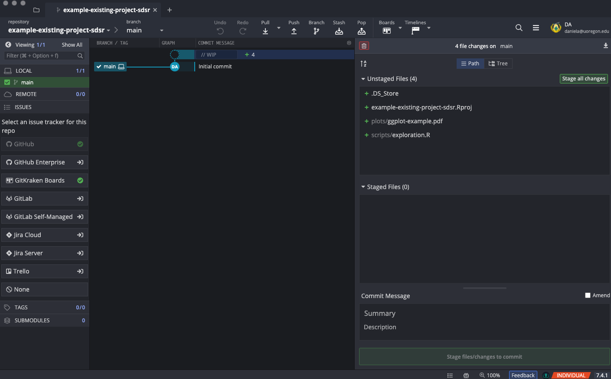
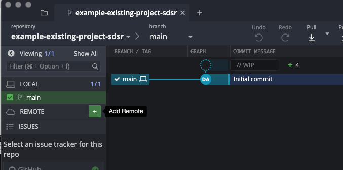
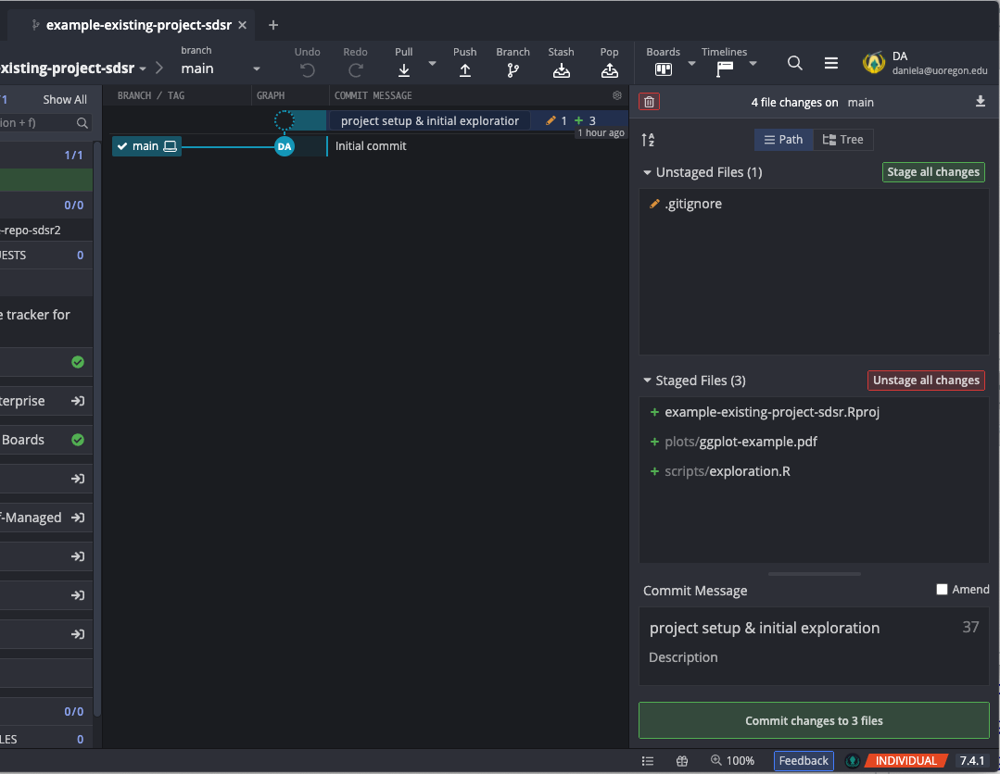
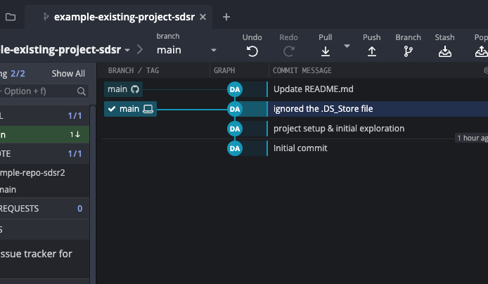

# Collaborating with git and Github

Anyone who has ever worked on any sort of collaborative writing project (code or otherwise) has likely run into frustrations of *version control*. For example, I might be working on some revisions to a document. I make some edits and send it to my colleague. By the time they get my version, however, it's already *behind* their version in other areas (e.g, maybe they revised their description of the analysis at the same time I provided edits to the document in whole). They can't just accept my edits without losing other changes, but they'd like to incorporate *both* changes. In many situations like this, version control is handled by naming conventions, e.g., `"full-manuscript_v1.docx"` becomes `"full-manuscript_v1da.docx"` which then becomes `"full-manuscript_v2.docx"` until we eventually end up with `"full-manuscript_vFinal.docx"` which inevitably ends up as `"full-manuscript_vFinalv2.docx"` and so on until we actually call the document complete. *git* is an alternative approach to managing version of a document by tracking changes to the *lines* of documents. If two people are working on the same document, but editing different lines, those changes will be merged together automatically. Critically, however, nothing is lost and *the entire history of the project is stored* from its initial creation through the final stages. *git* was initially created for software developers, but we advocate for its use for a broader range of applications, including dynamic documents (i.e., anything produced through [RMarkdown](https://rmarkdown.rstudio.com)). From our view, the learning curve for *git* is deceptively steep. We often see discussions of *git* being simple (e.g., "learn these five commands to work with *git*") with little explicit instruction devoted to the topic. Rather, it is a skill that is presumed one will "pick up" along the way. While there are exceptions to this (e.g., the wonderful [Happy Git and GitHub for the useR](https://happygitwithr.com) book by Jenny Bryan), we felt it important to cover the topic explicitly. 

This chapter aims to cover:

* Creating repositories
	- GitHub first or GitHub second
* Making commits
	- Merge conflicts
* Working with existing repositories
* Branching, forking and stashing
* Pull Requests

This chapter is not intended to be all encompassing. For example, we will not cover more advanced topics like [rebase-ing](https://git-scm.com/book/en/v2/Git-Branching-Rebasing) (which can be important if your branch is several commits behind the branch you want to merge with). Additionally, this chapter will emphasize the use of a GUI (graphical user interface) for working with *git*, specifically the [GitKraken](https://www.gitkraken.com) software, which has both free and Pro licensing. The primary drawback to the free tier is that you cannot work with private repositories. If all of your repositories are public, however, the free tier is likely sufficient. 

:::concept
 
**Repo**: Shorthand for repository - a collection of files that are tracked by *git*, along with the history of these files.

:::

GitKraken is to *git* as RStudio is to R. In other words, it is *not* a standalone software. Rather, it is an interface for working with *git*, just as RStudio is an integrated development environment (IDE) for working with R. GitHub is a *remote*, or online, hosting service for *git*. As we will see later, you (and all of your collaborators) will have the entire git repository stored on your local machine. GitHub allows you to collaborate on that repo through a network. You should always think of *git* through both your local (on your computer) and remote (on GitHub) repositories. Many beginners conflate *git* with *GitHub* in particular, and sometimes with GitKraken as well. It is important to realize these are all separate. *git* is essentially the engine behind it all, while GitKraken provides us with a nicer user interface, and GitHub allows us to host our repos online. Note that there are other online git hosting services, such as https://bitbucket.org and https://about.gitlab.com. We have chosen to go with GitHub because it is the most popular among R users (at the time of this writing).

We have chosen to illustrate the topics throughout this chapter using GitKraken, rather than the command line interface, because in our prior experience teaching the content, the visual interface of GitKraken helps reinforce the concepts, particularly branching and stashing. However, it is important to note that *all* of the concepts discussed in this chapter can also be accomplished through direct code through a terminal window using `git [command]`. Additionally, some of the more advanced topics (e.g., [cherry picking](https://git-scm.com/docs/git-cherry-pick)) cannot (to our knowledge) be completed through GitKraken, and must be completed through the command line interface. 

The fundamental goals of this chapter, however, are to (a) help you understand the structure of *git*, which will help you be better equipped to solve unexpected problems, and (b) provide you the tools for roughly 95% of the (typical) work you will need to do with *git*. 

:::lightbulb

:::title
The big picture
:::

The primary reason we use *git* is to track changes of documents and collaborate with colleagues on documents in a way that allows all parties to contribute together. GitHub is the online host for our *git* repository, while *GitKraken* is a tool we use to make *git* more visual and easier to use/understand.

:::

In what follows, it may not always be immediately clear why we're doing each step, but our hope is that this will become more clear as you progress through the chapter.

## Getting Started

To get started using *git* we'll need to do four things:

* Download and install *git* 
* Register a GitHub account
* Download and install GitKraken
* Connect GitKraken to your GitHub account

To download git, go to the official [website](https://git-scm.com/downloads) and select your operating system. Following this selection, a binary will either begin downloading (if you select Windows) or you will be provided with download/installation instructions. On a Mac, for example, it is recommended that you install [homebrew](https://brew.sh/) then run `brew install git` through the terminal.

:::warning
Installing and configuring software can be difficult and frustrating. Unfortunately, each computer is like a snowflake, unique in its own ways. The guidelines provided here are meant to be a helpful starting point, but are bound to be incomplete for some. If you run into installation issues, please read the documentation from the corresponding software carefully. If that is unhelpful, consider searching forums like [Stack Overflow](https://stackoverflow.com) for users who have had similar issues.
:::

To register a GitHub account, go to https://github.com and click the "Sign up" button. At the time of this writing, this looks like the below. This process should be relatively straightforward and will require you to choose a username (which will be public) and link your account with an email.

Once you've registered your account, you will likely see a timeline of activity which, assuming this is your first time logging in, will probably be mostly empty. A screenshot of Daniel's timeline at the time of this writing is below. Notice it has both his recent activity, along with the recent activity of people he follows, and people who have interacted with (starred) his repos. On GitHub you can choose to follow other developers and see their activity like this, which is a great way to discover new and exciting projects. In addition to following specific users, you can also "star" specific repositories (projects) that interest you, which will effectively bookmark them in your repo for easy access (click on the drop down menu from the icon in the top right and select "Your stars").

You can also see your profile by clicking your icon in the top right (then selecting "Your profile") or by going directly to https://github.com/[username]. On your profile page you can choose to "pin" specific repositories (the default will just have your repositories that you most recently contributed to), display a brief bio and link to a website, and display your contribution history. Your profile is a great way to communicate your skills and activity with potential employers in a quick "snapshot" format. 

Finally, the final step is to [download GitKraken](https://www.gitkraken.com/download), install like you would any standard software, and connect it with your GitHub account. This should happen essentially automatically by logging into GitKraken through your GitHub account. 

Assuming this is successful, you should get the following notification

## Creating a repository

Generally when you're working with a project in R, it starts one of two ways: (a) you are beginning a new project, and you know it's something you want to keep track of, document, and share, or (b) you are exploring some data, and the resulting work may move into another project, or develop into a larger project on its own. In either case, we recommend using version control, but the way you approach using version control may differ. For example, if you know from the start that you want this will be a long-lasting or important project, you should probably start the project by initializing a git repo. If, instead, you're just doing some exploratory analyses, there's a chance that work could move into an existing repo or, perhaps, even thrown away. In that case, you may find yourself in a situation where you've want to start a repository with an *existing* project. We'll cover each of this situations below.

### Starting with an empty project
Generally, if you're starting a new project, you should by initializing a repo. The easiest way to do this is to:

* Create a new empty repo on Github
* Clone the repo locally
* Start your project (i.e., [RStudio Projects](https://rstudio.com/resources/webinars/managing-part-1-projects-in-rstudio/))
* Commit your initial changes
* Push the changes to the remote

Once you're logged into GitHub, you will see a `+` in the top right of the navigation bar with a drop down menu. In the menu, you will see "New repository". 

You can then choose a name for the repo, which would ideally be descriptive of the project, provide a (slightly) more detailed description of project, whether the repo should be public or private, and any files the repo should be initialized with. Note that the repo name must be unique to your username (i.e., you can't have two repos with the same name). I typically initialize the repo with a README, which I fill in more later, along with a `.gitignore` file and a basic license. GitHub has many `.gitignore` templates that are helpful, including one for R. The `.gitignore` file will tell the repo what files *should not* be tracked by *git*. There are also a number of different licenses that are available, and even more that could be added after (e.g., using `usethis::use_[name]_license`, where `[name]` is the abbreviation for the specific license, such as`ccby`). 

The repository is now setup *on the remote*, or on GitHub. 

But we still need to get it on our local computer. We do this by *cloning* the remote repo to our local. We can clone with GitKraken, but first we want to copy the link to the remote repo. We do this by first clicking on the green "code" button then clicking the clipboard, which will copy the link shown. 

:::concept

**Cloning**: Copy all the files and the commit history from a remote (online) repo to your local computer.

:::

Next, we're going to open GitKraken, and select "Clone a repo".

There are multiple ways to clone the repo from GitKraken, but we've generally found the URL approach to be the easiest. You can click "Browse" to change the location that the repo will be cloned to (you will get a new folder downloaded that has the entire contents of the online repo). You then paste the URL we copied earlier into the respective field and click "Clone the repo!". 

GitKraken will then download the files, and you will be prompted with a dialogue box asking if you would like to open the repository in GitKraken. 

Select "Yes" and you will see the repository. 

In the middle of the screen you will see "Initial commit". This is where you will see all the commits that have been made, along with the commit messages. This probably doesn't make a whole lot of sense until we start our project and start making commits. But first, let's talk about how to initialize a repo with an existing project.

### Starting with an existing project

I regularly find myself in situations where I have written code that I thought would be "throw away" work, but evolves into a larger project. Anytime the project is ongoing, you should consider using *git*, and in particular, if you are collaborating on a project with others.

Let's say I have an existing project that looks like the below. There are two folders, currently, one for scripts and one for plots. We might also (typically) have a folder for data, but in this case my script uses built-in data so there's no need to store it here.

I've decided this is an important project that is going to last beyond just today. I'm therefore going to use version control (via *git*) and connect it to a remote repo. We start by going to GitKraken clicking "Start a local repo".

We then "Browse" to find the folder. Importantly (and rather strangely) we need to have the name of the folder in "Name", which means the "initialize in" field should be the folder our project is in, rather than our project folder itself. This will make the "Full path" field go to our project folder. At this point you can initialize with a .gitignore file and License from GitKraken defaults. You can ignore the "Default branch name" field and just keep it as "main", which is the newest standard.

After you click "Create repository" it will take you to a similar screen that we saw before. The difference is now you will see `//WIP` above the initial commit and file names in the "Unstaged Files" area. We'll get to all this in a bit. 

If you look back at your actual folder, and you have hidden files set to be visible (on a Mac, `⌘` + `shift` + `.`), you will see a `.git` folder. This is all the infrastructure needed to *monitor* all the files in the folder. 

You'll now also see the `.gitignore` file (which is also viewable through the "Files" pane in RStudio) which tells *git* the files that it should **not** monitor. If we open this up (either through a text editor or RStudio) you will see things like `.Rhistory` and `/cache/`. These are the defaults from the template we used, but we could delete anything in here and *git* would then monitor those files. Similarly, there may be other files we want to ignore, and we could add those here. For example, you might want make a project mostly publicly available, but not include private, protected data. You could do this by adding a folder that has all of the data you do *not* want share, and then put the name of this folder in th .gitignore file (e.g., adding `private-data/` would ignore all the files in the "private-data" folder).

Now, we need to connect this repo to a remote, or online repo on GitHub. Just as before, we're going to go to GitHub and create a new repo there. Unlike before, however, we want to create the repo *without any files* (i.e., no license, .gitignore file, or README, because). You can still give your repo a description online, but it should not have any existing files because we already have them all locally. 

Once you've created the empty repo, it will look like the below, providing suggestions for connecting this remote repo to a local repo. 

Finally, we're just going to copy the link, as we did before, got back to GitKraken, and click the green plus button (only shows up on hover) on the remote section of the tool bar on the left-hand side.

This will then bring up a dialogue box (below) asking how you would like to add the remote. Click on URL along the top, then enter the name of the repo and paste the URL in the "Pull URL" box. The text you enter into "Pull URL" should be automatically copied to "Push URL", but if not, copy it there too. 

Finally, click the "Add Remote" button, and you're done! Very little will actually change on the GitKraken side, but you should see the name the remote repo listed under "Remote" on the left-hand side (below where you clicked the button to add a remote).

## Making commits and pushing to the remote

Everything we've done to this point may seem like a fair amount of work just to get setup, but this process quickly becomes second nature. And, now that we are setup to monitor all of our files, we can make some changes, *commit* those changes locally, and then *push* the changes to our remote repository.

:::dictionary

:::title
Important *git* vocabulary: Part I
:::

**Stage**: Prepare a file (or files) for a commit. All files in the staging area during a specific commit will be associated with the same commit and commit message.

**Commit**: This is where you will, essentially, save the version of the file(s) in the repo. You *commit* the changes to the repo.

**Push**: Upload changes from your local repository to the remote repository. Note this will *only* push the most recent changes.

**Pull**: Download the most recent changes from the remote repository to your local repository. Note this will *only* pull the most recent changes.

:::

Let's go back to what our repository looked like after initializing locally (starting from an existing project). 

Notice that we have four files listed in the "Unstaged Files" pane, including one called ".DS_Store", which is [an internal file used on Mac machines](https://en.wikipedia.org/wiki/.DS_Store). This is an example of a file that we should ignore. It's irrelevant to our project and, beyond cluttering our repo, could actually make things more difficult for us in collaborating with others. Let's go into RStudio, open our .gitignore file, and add `.DS_Store`.

Then if we go back to GitKraken, you will see that *immediately* the .DS_Store file is gone and, similarly, we see the .gitignore file shows up in its place, but with a different icon. The green plus symbol shown by the other files imply they are *new*, while the pencil indicates the file has been *modified* since the previous commit. If we click on the file (in the Unstaged Files pane) it will open up a *diff* view, showing us the difference between the file as it currently exists relative to its previous state (i.e., since the last time the file was comitted to the repository). In this case, we see two new green lines, indicating two lines were added (lines that have been removed show up in red) with one of them including the text ".DS_Store". 

To commit files, we have to first stage them. As shown in the box above, files that are staged together will be associated with the same commit and the same commit message. Let's first stage the new files and add a commit message. Ideally, these should be brief but descriptive of the change that occurred so you can later scan commit messages to get a feel for how the project evolved, and/or revisit a specific commit if needed (i.e., go back to an older version of a file).

Once we click the green "Commit changes to 3 files" button, we will have made a new commit to our repo (locally). Let's create another commit (stage/commit)with the .gitignore file.

Notice the `//WIP` area is gone because committed all of the changes to our repo. However, *any* change that occurs to any file in our project folder that is not listed in the .gitignore will show up as having been modified since our last commit. This is quite powerful, and one of the main benefits of using *git*.

Now that we have committed our changes *locally*, we want to *push* them to the remote (i.e., github.com). On GitKraken, this just means clicking the "Push" button right above our commits. The first time we do this we'll get a message asking what branch we want to push to. In most cases, the default here is what we want. We want our `main` branch locally to push to our `main` branch on the remote. After this is set it will not change unless you change it manually. 

Shortly after pushing, you should get a message on GitKraken stating that you pushed sucessfully. Now, if you go to your repo online and refresh, you will see our changes. 

There are a few things here that are incredibly helpful for not only collaboration, but conducting your work in a transparent and open way. First, you can see that not only are the files now posted on GitHub, but also all the commits we made. If we click on the commits (where the green arrow is pointing in the above picture) we can see all of the commits that have been made since the project began. 

Each of these commits also link to the diff view, showing the difference between the file in that commit and its previous state.

In some ways, this may lead to feelings of vulnerability, particularly as you are learning new skills. However, it is worth noting that GitHub repositories are *very* rarely reviewed by anybody outside of the people managing it. But, working with a version control system also allows you to be open in your process, while also never losing work. You can always go back to previous versions of files and, as we'll see with branching, this can often free you up to experiment without fear of "burning the house down".

### Merge conflicts
In this case, we are working on this repository alone. But let's replicate what it would look like if an external collaborator made changes. We'll do this by editing the README file directly on GitHub (by clicking the pencil icon on the README) and committing the changes there. This will put the remote branch ahead of our local branch.

If we go back to GitKraken, you will see that we now have two icons that are separated. The icon that says "main" with the GitHub logo is the main *on the remote*, while the icon that says "main" with the laptop logo is the main *on our local*. These are no longer in sync---our remote is ahead of our local by one commit. To get these changes to our local, we would need to *pull* (just click to pull button) and the README file on our local would (suddenly) look just like the one on GitHub.

:::concept
Each time you start to work on your project, you should first pull for the most recent changes. This will help avoid merge conflicts. When you are done working for the day, make sure you commit all of your changes and push them to the remote (so others can pull them down). It is also a good idea to ignore any files that are automatically generated by code so you don't run into merge conflicts with things like dates changing in html files.
:::

However, rather than pulling first (as we should) let's make edits to the same file, on the same lines, commit those changes locally, and try to push them to the remote. This is the equivalent of two collaborators working on the same lines of the same file and both committing them to the repo, without first pulling the most recent changes.

## Collaborating

### Branching

### Stashing

### Forking
