# Collaborating with git and Github

Anyone who has ever worked on any sort of collaborative writing project (code or otherwise) has likely run into frustrations of *version control*. For example, I might be working on some revisions to a document. I make some edits and send it to my colleague. By the time they get my version, however, it's already *behind* their version in other areas (e.g, maybe they revised their description of the analysis at the same time I provided edits to the document in whole). They can't just accept my edits without losing other changes, but they'd like to incorporate *both* changes. In many situations like this, version control is handled by naming conventions, e.g., `"full-manuscript_v1.docx"` becomes `"full-manuscript_v1da.docx"` which then becomes `"full-manuscript_v2.docx"` until we eventually end up with `"full-manuscript_vFinal.docx"` which inevitably ends up as `"full-manuscript_vFinalv2.docx"` and so on until we actually call the document complete. *git* is an alternative approach to managing versions of a document by tracking changes to the *lines* of documents. If two people are working on the same document, but editing different lines, those changes will be merged together automatically. Critically, however, nothing is lost and *the entire history of the project is stored* from its initial creation through the final stages. *git* was initially created for software developers, but we advocate for its use for a broader range of applications, including dynamic documents (i.e., anything produced through [RMarkdown](https://rmarkdown.rstudio.com)). From our view, the learning curve for *git* is deceptively steep. We often see discussions of *git* being simple (e.g., "learn these five commands to work with *git*") with little explicit instruction devoted to the topic. Rather, it is a skill that is presumed one will "pick up" along the way. While there are exceptions to this (e.g., the wonderful [Happy Git and GitHub for the useR](https://happygitwithr.com) book by Jenny Bryan), we felt it important to cover the topic explicitly. 

This chapter aims to cover:

* Creating repositories
	- GitHub first or GitHub second
* Making commits
	- Merge conflicts
* Working with existing repositories
* Branching, forking and stashing
* Pull Requests

This chapter is not intended to be all encompassing. For example, we will not cover more advanced topics like [rebase-ing](https://git-scm.com/book/en/v2/Git-Branching-Rebasing) (which can be important if your branch is several commits behind the branch you want to merge with). Additionally, this chapter will emphasize the use of a GUI (graphical user interface) for working with *git*, specifically the [GitKraken](https://www.gitkraken.com) software, which has both free and Pro licensing. The primary drawback to the free tier is that you cannot work with private repositories. If all of your repositories are public, however, the free tier is likely sufficient. 

:::concept
 
**Repo**: Shorthand for repository - a collection of files that are tracked by *git*, along with the history of these files.

:::

GitKraken is to *git* as RStudio is to R. In other words, it is *not* a standalone software. Rather, it is an interface for working with *git*, just as RStudio is an integrated development environment (IDE) for working with R. GitHub is a *remote*, or online, hosting service for *git*. As we will see later, you (and all of your collaborators) will have the entire git repository stored on your local machine. GitHub allows you to collaborate on that repo through a network. You should always think of *git* through both your local (on your computer) and remote (on GitHub) repositories. Many beginners conflate *git* with *GitHub* in particular, and sometimes with GitKraken as well. It is important to realize these are all separate. *git* is essentially the engine behind it all, while GitKraken provides us with a nicer user interface, and GitHub allows us to host our repos online. Note that there are other online git hosting services, such as https://bitbucket.org and https://about.gitlab.com. We have chosen to go with GitHub because it is the most popular among R users (at the time of this writing).

We have chosen to illustrate the topics throughout this chapter using GitKraken, rather than the command line interface, because in our prior experience teaching the content, the visual interface of GitKraken helps reinforce the concepts, particularly branching and stashing. However, it is important to note that *all* of the concepts discussed in this chapter can also be accomplished through direct code through a terminal window using `git [command]`. Additionally, some of the more advanced topics (e.g., [cherry picking](https://git-scm.com/docs/git-cherry-pick)) cannot (to our knowledge) be completed through GitKraken, and must be completed through the command line interface. 

The fundamental goals of this chapter, however, are to (a) help you understand the structure of *git*, which will help you be better equipped to solve unexpected problems, and (b) provide you the tools for roughly 95% of the (typical) work you will need to do with *git*. 

:::lightbulb

:::title
The big picture
:::

The primary reason we use *git* is to track changes of documents and collaborate with colleagues on documents in a way that allows all parties to contribute together. GitHub is the online host for our *git* repository, while *GitKraken* is a tool we use to make *git* more visual and easier to use/understand.

:::

In what follows, it may not always be immediately clear why we're doing each step, but our hope is that this will become more clear as you progress through the chapter.

## Getting Started

To get started using *git* we'll need to do four things:

* Download and install *git* 
* Register a GitHub account
* Download and install GitKraken
* Connect GitKraken to your GitHub account

To download git, go to the official [website](https://git-scm.com/downloads) and select your operating system. Following this selection, a binary will either begin downloading (if you select Windows) or you will be provided with download/installation instructions. On a Mac, for example, it is recommended that you install [homebrew](https://brew.sh/) then run `brew install git` through the terminal.

:::warning
Installing and configuring software can be difficult and frustrating. Unfortunately, each computer is like a snowflake, unique in its own ways. The guidelines provided here are meant to be a helpful starting point, but are bound to be incomplete for some. If you run into installation issues, please read the documentation from the corresponding software carefully. If that is unhelpful, consider searching forums like [Stack Overflow](https://stackoverflow.com) for users who have had similar issues.
:::

To register a GitHub account, go to https://github.com and click the "Sign up" button. At the time of this writing, this looks like the below. This process should be relatively straightforward and will require you to choose a username (which will be public) and link your account with an email.

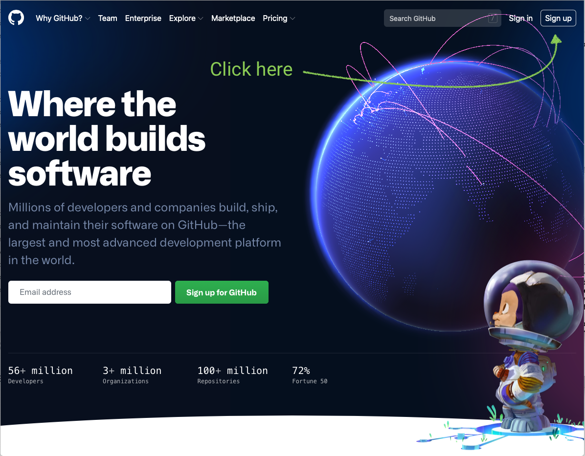

Once you've registered your account, you will likely see a timeline of activity which, assuming this is your first time logging in, will probably be mostly empty. A screenshot of Daniel's timeline at the time of this writing is below. Notice it has both his recent activity, along with the recent activity of people he follows, and people who have interacted with (starred) his repos. On GitHub you can choose to follow other developers and see their activity like this, which is a great way to discover new and exciting projects. In addition to following specific users, you can also "star" specific repositories (projects) that interest you, which will effectively bookmark them in your repo for easy access (click on the drop down menu from the icon in the top right and select "Your stars").

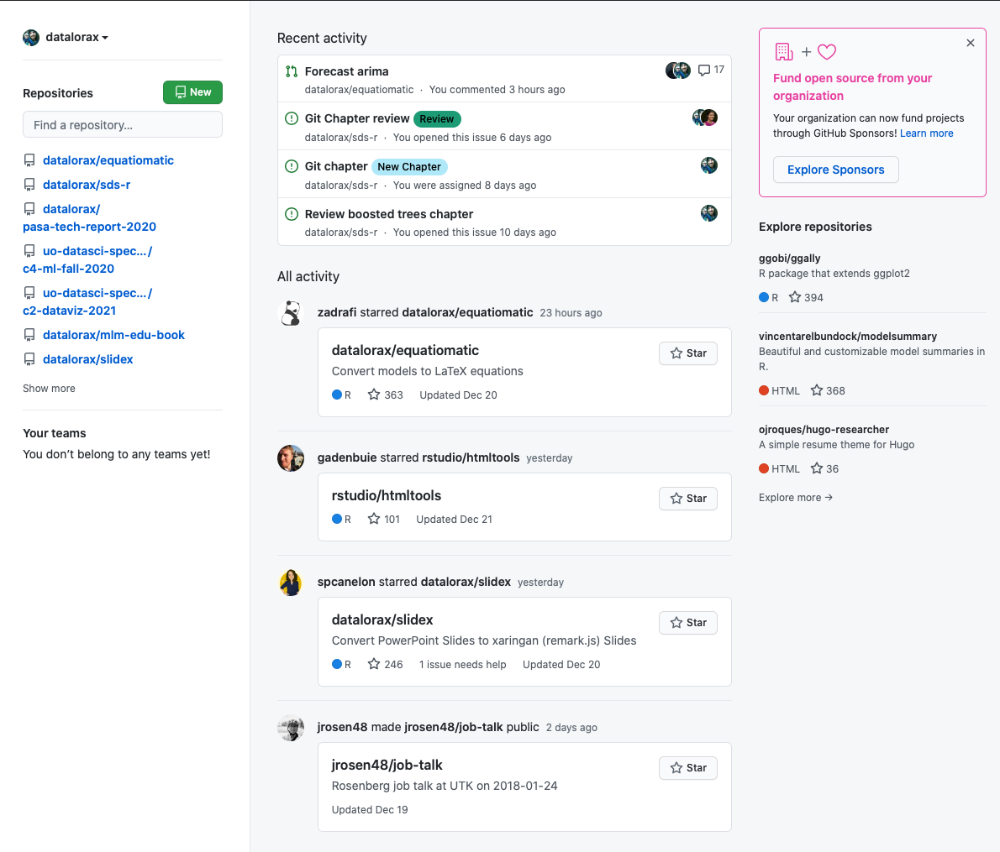

You can also see your profile by clicking your icon in the top right (then selecting "Your profile") or by going directly to https://github.com/[username]. On your profile page you can choose to "pin" specific repositories (the default will just have your repositories that you most recently contributed to), display a brief bio and link to a website, and display your contribution history. Your profile is a great way to communicate your skills and activity with potential employers in a quick "snapshot" format. 

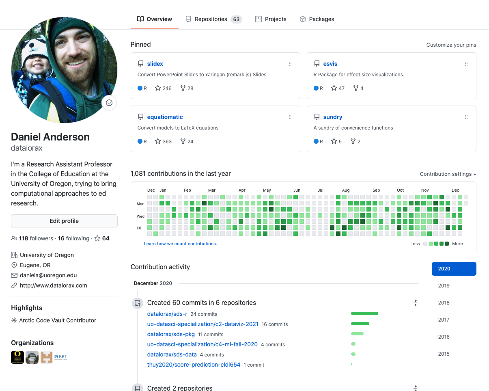

Finally, the final step is to [download GitKraken](https://www.gitkraken.com/download), install like you would any standard software, and connect it with your GitHub account. This should happen essentially automatically by logging into GitKraken through your GitHub account. 

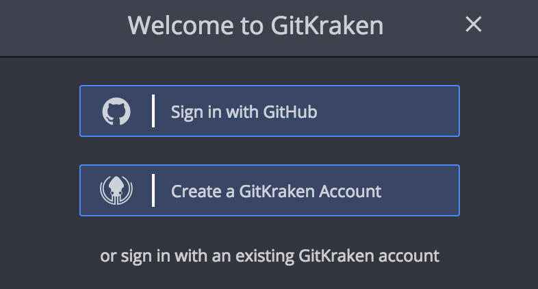

Assuming this is successful, you should get the following notification

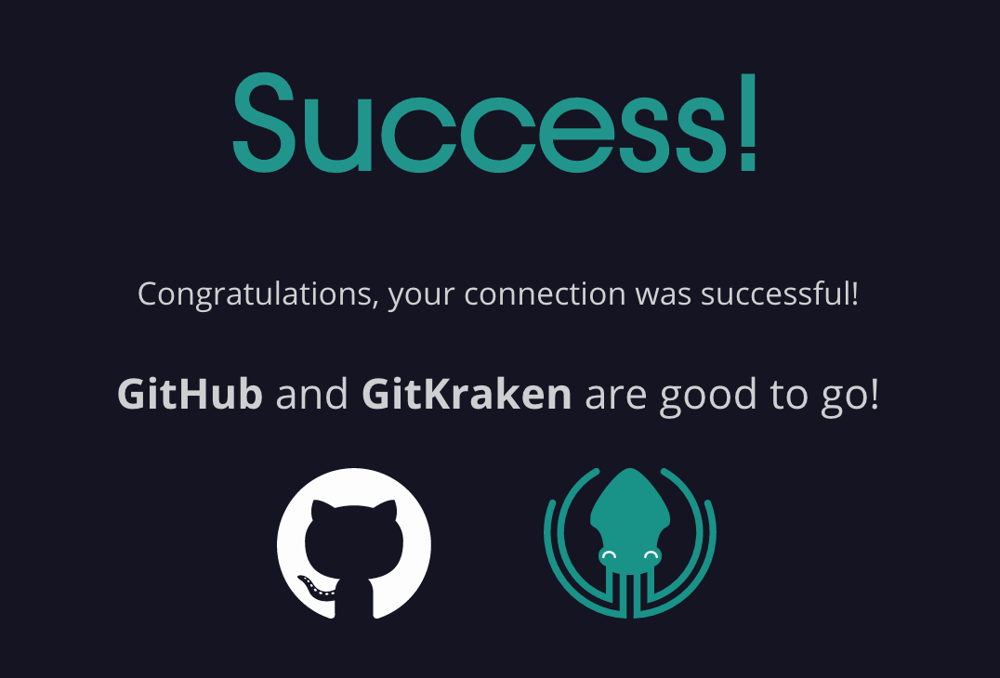

## Creating a repository

Generally when you're working with a project in R, it starts one of two ways: (a) you are beginning a new project, and you know it's something you want to keep track of, document, and share, or (b) you are exploring some data, and the resulting work may move into another project, or develop into a larger project on its own. In either case, we recommend using version control, but the way you approach using version control may differ. For example, if you know from the start that you want this to be a long-lasting or important project, you should probably start the project by initializing a git repo. If, instead, you're just doing some exploratory analyses, there's a chance that work could move into an existing repo or, perhaps, even thrown away. In that case, you may find yourself in a situation where you've want to start a repository with an *existing* project. We'll cover each of these situations below.

### Starting with an empty project
Generally, if you're starting a new project, you should do it by initializing a repo. The easiest way to do this is to:

* Create a new empty repo on Github
* Clone the repo locally
* Start your project (i.e., [RStudio Projects](https://rstudio.com/resources/webinars/managing-part-1-projects-in-rstudio/))
* Commit your initial changes
* Push the changes to the remote

Once you're logged into GitHub, you will see a `+` in the top right of the navigation bar with a drop down menu. In the menu, you will see "New repository". 

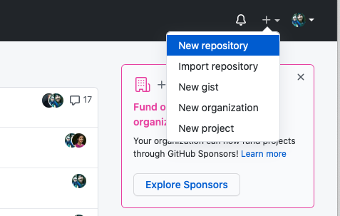

You can then choose a name for the repo, which would ideally be descriptive of the project, provide a (slightly) more detailed description of project, whether the repo should be public or private, and any files the repo should be initialized with. Note that the repo name must be unique to your username (i.e., you can't have two repos with the same name). I typically initialize the repo with a README, which I fill in more later, along with a `.gitignore` file and a basic license. GitHub has many `.gitignore` templates that are helpful, including one for R. The `.gitignore` file will tell the repo what files *should not* be tracked by *git*. There are also a number of different licenses that are available, and even more that could be added after (e.g., using `usethis::use_[name]_license`, where `[name]` is the abbreviation for the specific license, such as`ccby`). 

<!-- I think it would make it more simple for the beginner to say use MIT License and .gitignore template:R as shown in the screenshot below -->

The repository is now setup *on the remote*, or on GitHub. 

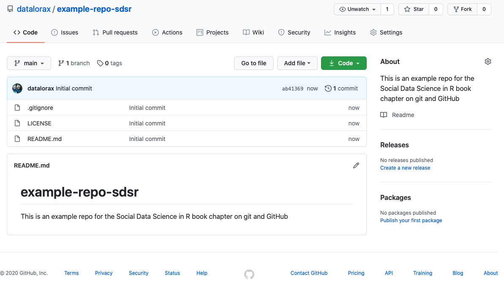

But we still need to get it on our local computer. We do this by *cloning* the remote repo to our local. We can clone with GitKraken, but first we want to copy the link to the remote repo. We do this by first clicking on the green "code" button then clicking the clipboard, which will copy the link shown. 

:::concept

**Cloning**: Copy all the files and the commit history from a remote (online) repo to your local computer.

:::

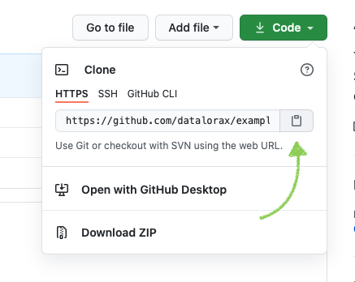

Next, we're going to open GitKraken, and select "Clone a repo".

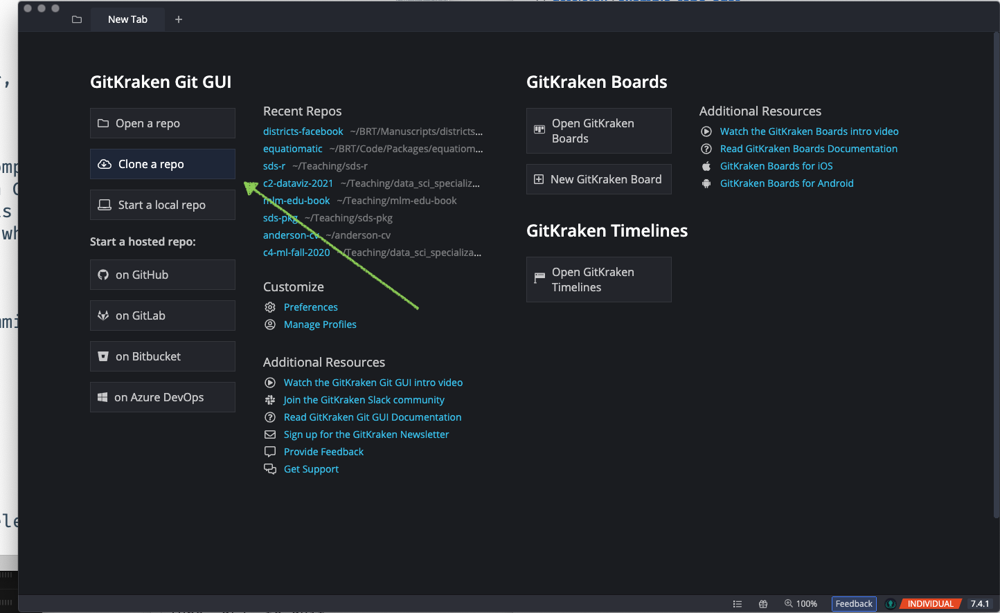

There are multiple ways to clone the repo from GitKraken, but we've generally found the URL approach to be the easiest. You can click "Browse" to change the location that the repo will be cloned to (you will get a new folder downloaded that has the entire contents of the online repo). You then paste the URL we copied earlier into the respective field and click "Clone the repo!". 

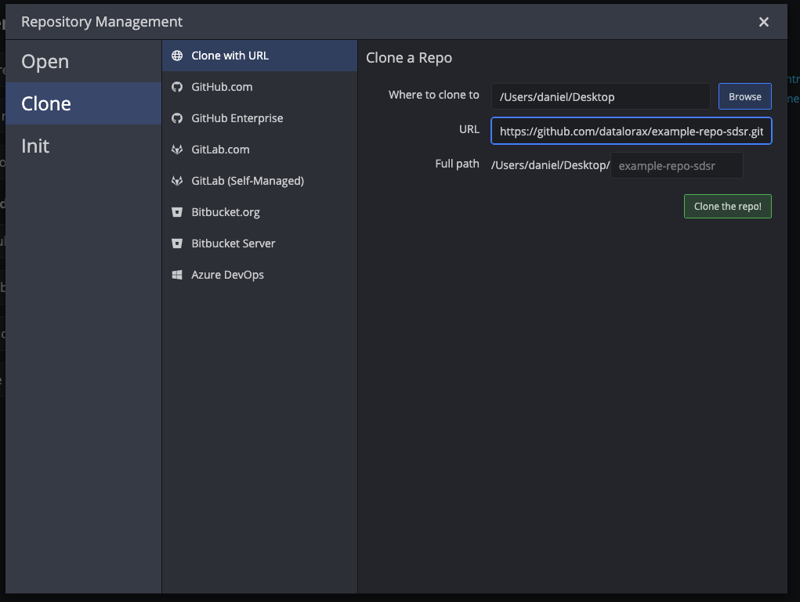

GitKraken will then download the files, and you will be prompted with a dialogue box asking if you would like to open the repository in GitKraken. 

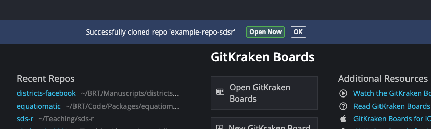

Select "Yes" and you will see the repository. 

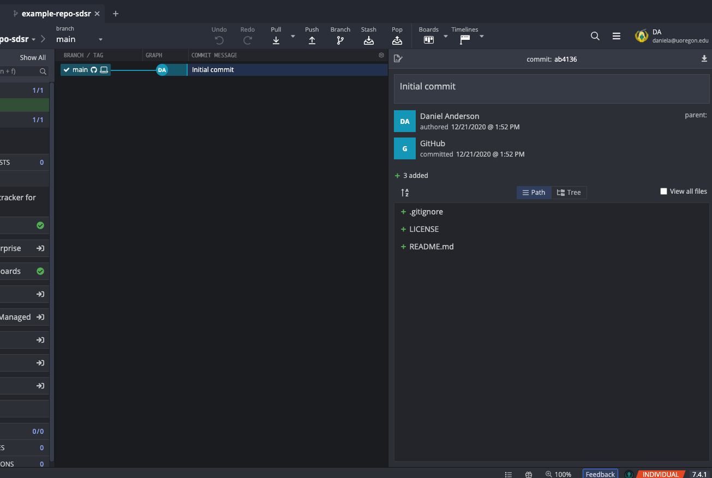

In the middle of the screen you will see "Initial commit". This is where you will see all the commits that have been made, along with the commit messages. This probably doesn't make a whole lot of sense at this point because we haven't talked about what commits are. However, this folder is now setup to monitor any files in it. If we add new files here, they will show up as new. If we make edits to an existing file, the changes to the specific lines will be tracked. We'll get to all of this more in a bit, but first let's talk about how to initialize a repo with an *existing* project.

### Starting with an existing project

I regularly find myself in situations where I have written code that I thought would be "throw away" work, but evolves into a larger project. Anytime the project is ongoing, you should consider using *git*, and in particular, if you are collaborating on a project with others.

Let's say I have an existing project that looks like the below. There are two folders, currently, one for scripts and one for plots. We might also (typically) have a folder for data, but in this case my script uses built-in data so there's no need to store it here.

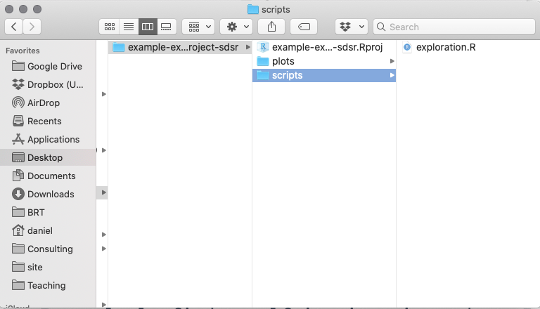

I've decided this is an important project that is going to last beyond just today. I'm therefore going to use version control (via *git*) and connect it to a remote repo. We start by going to GitKraken clicking "Start a local repo".

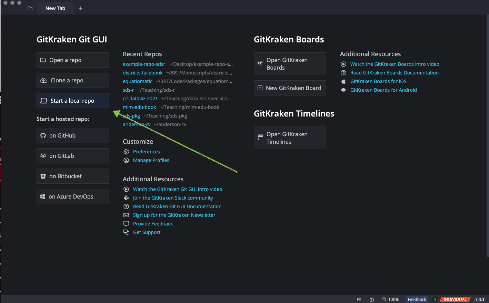

We then "Browse" to find the folder. Importantly (and rather strangely) we need to have the name of the folder in "Name", which means the "initialize in" field should be the folder our project is in, rather than our project folder itself. This will make the "Full path" field go to our project folder. At this point you can initialize with a .gitignore file and License from GitKraken defaults. You can ignore the "Default branch name" field and just keep it as "main", which is the newest standard.

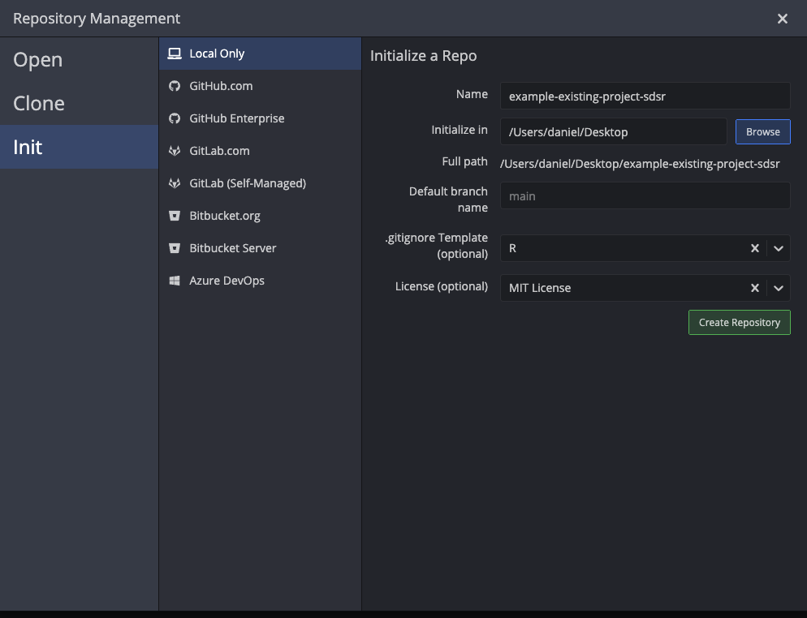

After you click "Create repository" it will take you to a similar screen that we saw before. The difference is now you will see `//WIP` above the initial commit and file names in the "Unstaged Files" area. We'll get to all this in a bit. 

If you look back at your actual folder, and you have hidden files set to be visible (on a Mac, `⌘` + `shift` + `.`), you will see a `.git` folder. This is all the infrastructure needed to *monitor* all the files in the folder. 

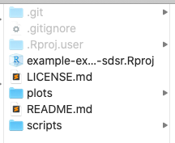

You'll now also see the `.gitignore` file (which is also viewable through the "Files" pane in RStudio) which tells *git* the files that it should **not** monitor. If we open this up (either through a text editor or RStudio) you will see things like `.Rhistory` and `/cache/`. These are the defaults from the template we used, but we could delete anything in here and *git* would then monitor those files. Similarly, there may be other files we want to ignore, and we could add those here. For example, you might want to make a project mostly publicly available, but not include private, protected data. You could do this by adding a folder that has all of the data you do *not* want to share, and then put the name of this folder in the .gitignore file (e.g., adding `private-data/` would ignore all the files in the "private-data" folder).

Now, we need to connect this repo to a remote, or online repo on GitHub. Just as before, we're going to go to GitHub and create a new repo there. Unlike before, however, we want to create the repo *without any files* (i.e., no license, .gitignore file, or README, because). You can still give your repo a description online, but it should not have any existing files because we already have them all locally. 

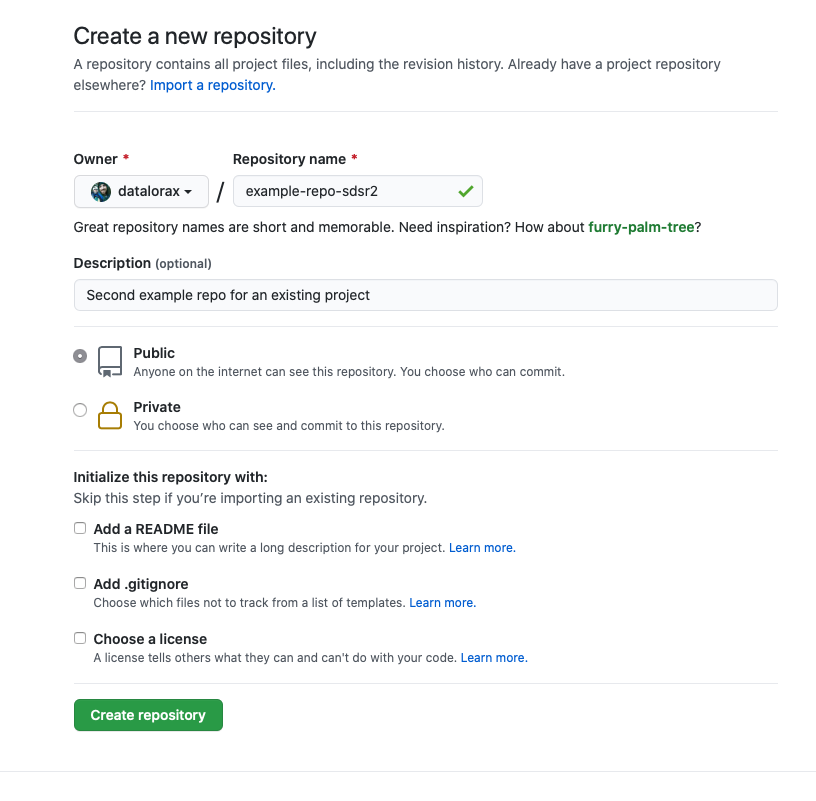

Once you've created the empty repo, it will look like the below, providing suggestions for connecting this remote repo to a local repo. 

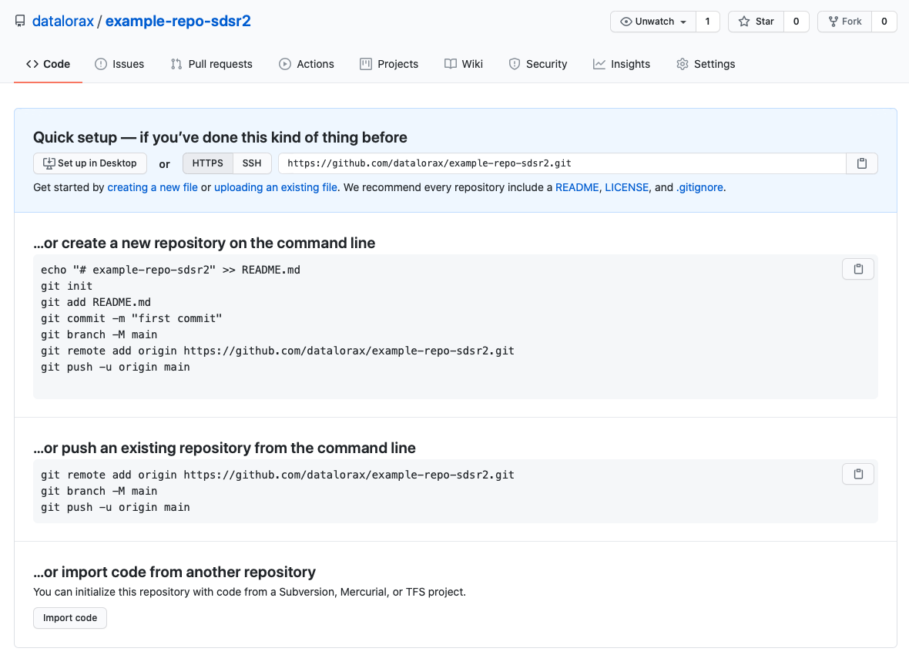

Finally, we're just going to copy the link, as we did before, go back to GitKraken, and click the green plus button (only shows up on hover) on the remote section of the tool bar on the left-hand side.

This will then bring up a dialogue box (below) asking how you would like to add the remote. Click on URL along the top, then enter the name of the repo and paste the URL in the "Pull URL" box. The text you enter into "Pull URL" should be automatically copied to "Push URL", but if not, copy it there too. 

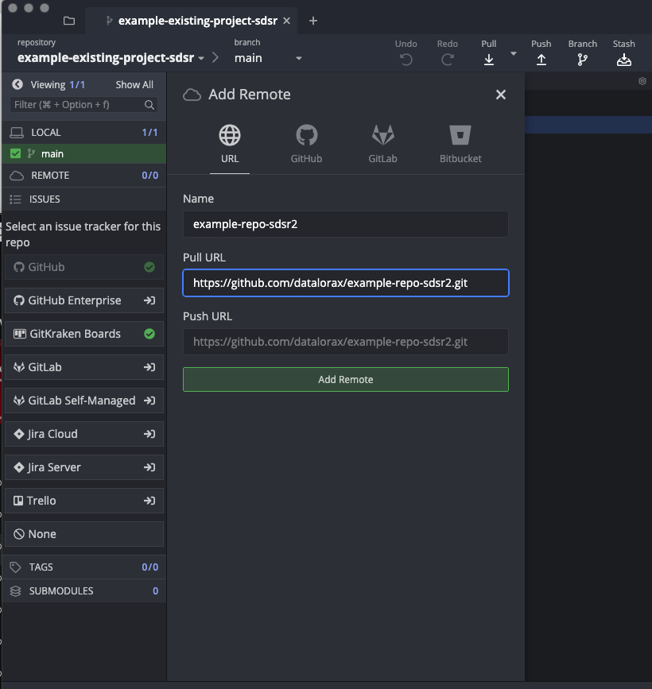

Finally, click the "Add Remote" button, and you're done! Very little will actually change on the GitKraken side, but you should see the name the remote repo listed under "Remote" on the left-hand side (below where you clicked the button to add a remote).

## Making commits and pushing to the remote

Everything we've done to this point may seem like a fair amount of work just to get setup, but this process quickly becomes second nature. And, now that we are setup to monitor all of our files, we can make some changes, *commit* those changes locally, and then *push* the changes to our remote repository.

:::dictionary

:::title
Important *git* vocabulary
:::

**Stage**: Prepare a file (or files) for a commit. All files in the staging area during a specific commit will be associated with the same commit and commit message.

**Commit**: This is where you will, essentially, save the version of the file(s) in the repo. You *commit* the changes to the repo.

**Push**: Upload changes from your local repository to the remote repository. Note this will *only* push the most recent changes.

**Pull**: Download the most recent changes from the remote repository to your local repository. Note this will *only* pull the most recent changes.

:::

Let's go back to what our repository looked like after initializing locally (starting from an existing project). 

Notice that we have four files listed in the "Unstaged Files" pane, including one called ".DS_Store", which is [an internal file used on Mac machines](https://en.wikipedia.org/wiki/.DS_Store). This is an example of a file that we should ignore. It's irrelevant to our project and, beyond cluttering our repo, could actually make things more difficult for us in collaborating with others. Let's go into RStudio, open our .gitignore file, and add `.DS_Store`.

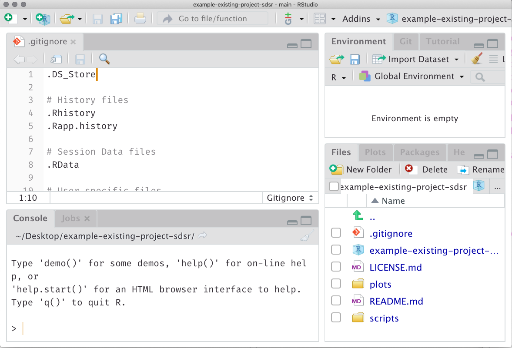

Then if we go back to GitKraken, you will see that *immediately* the .DS_Store file is gone and, similarly, we see the .gitignore file shows up in its place, but with a different icon. The green plus symbol shown by the other files imply they are *new*, while the pencil indicates the file has been *modified* since the previous commit. If we click on the file (in the Unstaged Files pane) it will open up a *diff* view, showing us the difference between the file as it currently exists relative to its previous state (i.e., since the last time the file was comitted to the repository). In this case, we see two new green lines, indicating two lines were added (lines that have been removed show up in red) with one of them including the text ".DS_Store". 

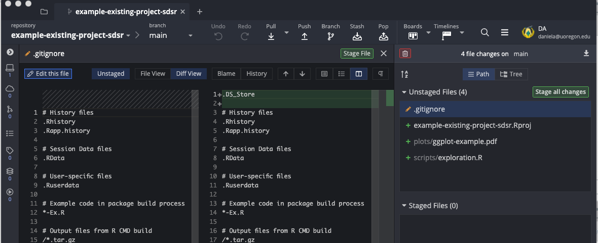

To commit files, we have to first stage them. As shown in the box above, files that are staged together will be associated with the same commit and the same commit message. Let's first stage the new files and add a commit message. Ideally, these should be brief but descriptive of the change that occurred so you can later scan commit messages to get a feel for how the project evolved, and/or revisit a specific commit if needed (i.e., go back to an older version of a file).

Once we click the green "Commit changes to 3 files" button, we will have made a new commit to our repo (locally). Let's create another commit (stage/commit)with the .gitignore file.

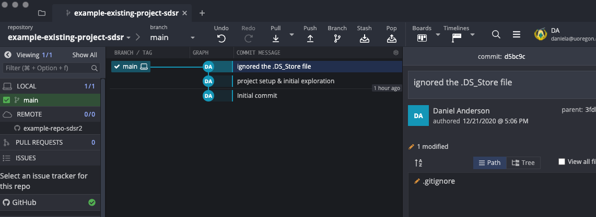

Notice the `//WIP` area is gone because committed all of the changes to our repo. However, *any* change that occurs to any file in our project folder that is not listed in the .gitignore will show up as having been modified since our last commit. This is quite powerful, and one of the main benefits of using *git*.

Now that we have committed our changes *locally*, we want to *push* them to the remote (i.e., github.com). On GitKraken, this just means clicking the "Push" button right above our commits. The first time we do this we'll get a message asking what branch we want to push to. In most cases, the default here is what we want. We want our `main` branch locally to push to our `main` branch on the remote. After this is set it will not change unless you change it manually. 

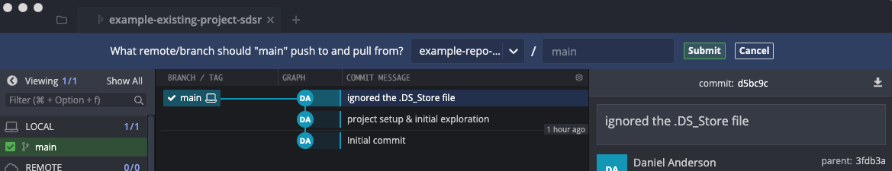

Shortly after pushing, you should get a message on GitKraken stating that you pushed sucessfully. Now, if you go to your repo online and refresh, you will see our changes. 

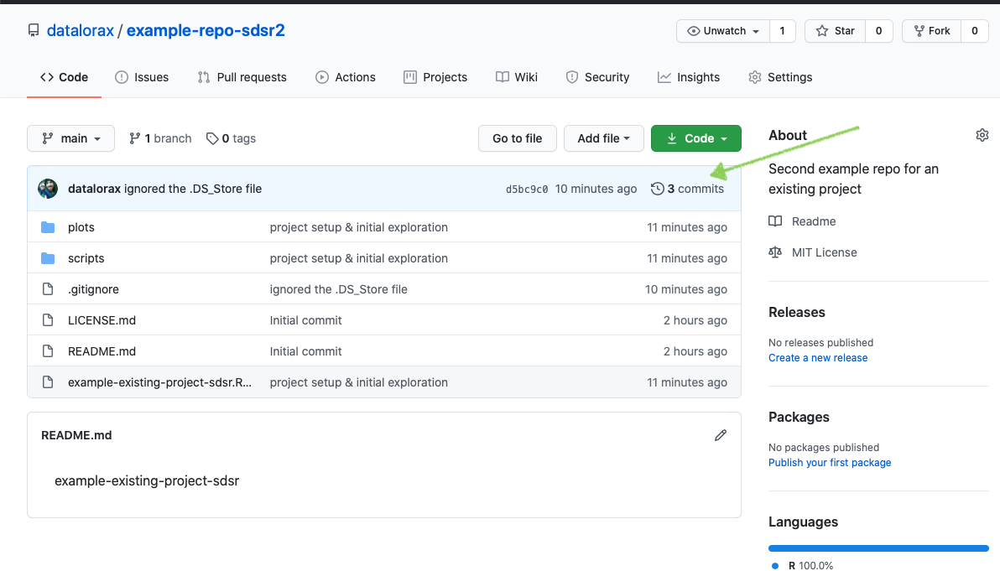

There are a few things here that are incredibly helpful for not only collaboration, but conducting your work in a transparent and open way. First, you can see that not only are the files now posted on GitHub, but also all the commits we made. If we click on the commits (where the green arrow is pointing in the above picture) we can see all of the commits that have been made since the project began. 

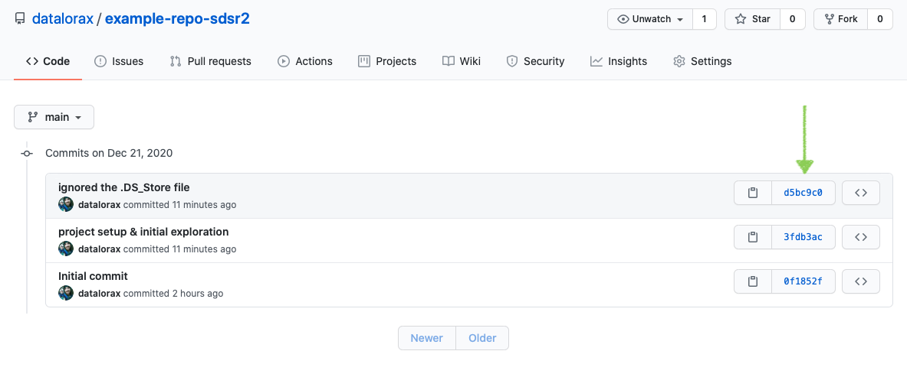

Each of these commits also link to the diff view, showing the difference between the file in that commit and its previous state.

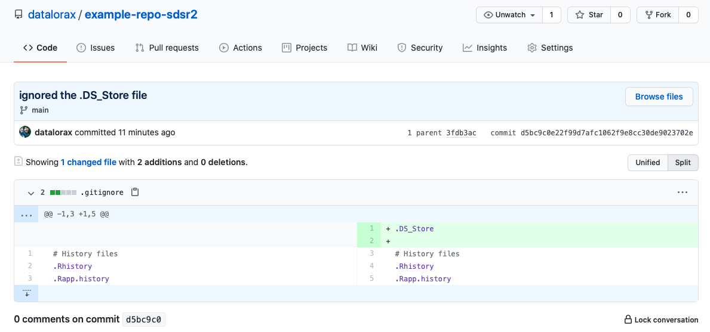

In some ways, this may lead to feelings of vulnerability, particularly as you are learning new skills. However, it is worth noting that GitHub repositories are *very* rarely reviewed by anybody outside of the people managing it. But, working with a version control system also allows you to be open in your process, while also never losing work. You can always go back to previous versions of files and, as we'll see with branching, this can often free you up to experiment without fear of "burning the house down".

### Merge conflicts
In this case, we are working on this repository alone. But let's replicate what it would look like if an external collaborator made changes. We'll do this by editing the README file directly on GitHub (by clicking the pencil icon on the README) and committing the changes there. This will put the remote branch ahead of our local branch.

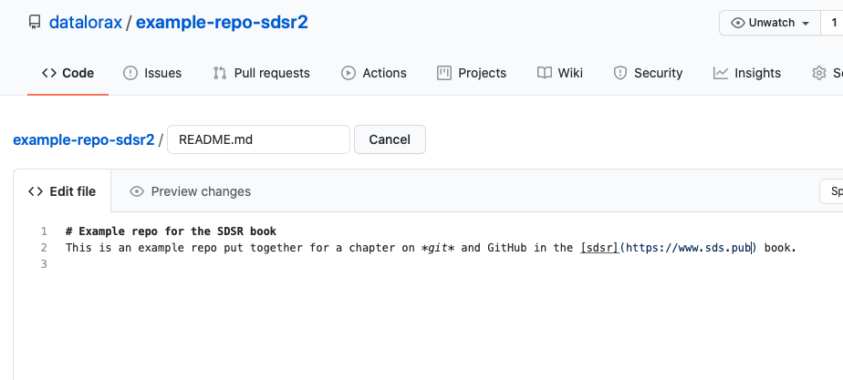

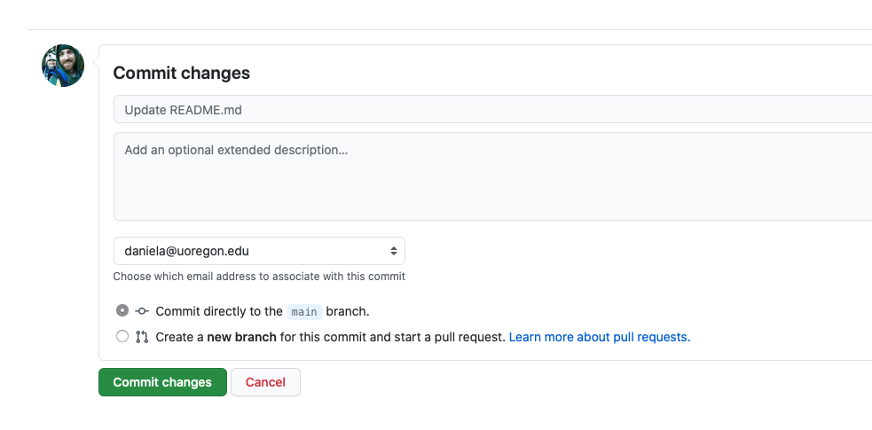

If we go back to GitKraken, you will see that we now have two icons that are separated. The icon that says "main" with the GitHub logo is the main *on the remote*, while the icon that says "main" with the laptop logo is the main *on our local*. These are no longer in sync---our remote is ahead of our local by one commit. To get these changes to our local, we would need to *pull* (just click to pull button) and the README file on our local would (suddenly) look just like the one on GitHub.

:::concept
Each time you start to work on your project, you should first pull for the most recent changes. This will help avoid merge conflicts. When you are done working for the day, or on that particular project, make sure you commit all of your changes and push them to the remote (so others can pull them down).
:::

However, rather than pulling first (as we should) let's make edits to the same file, on the same lines, commit those changes locally, and try to push them to the remote. This is the equivalent of two collaborators working on the same lines of the same file and both committing them to the repo, without first pulling the most recent changes.

On the remote, we made edits to the first and second lines. On our local, let's make edits to the first and third lines, like so:

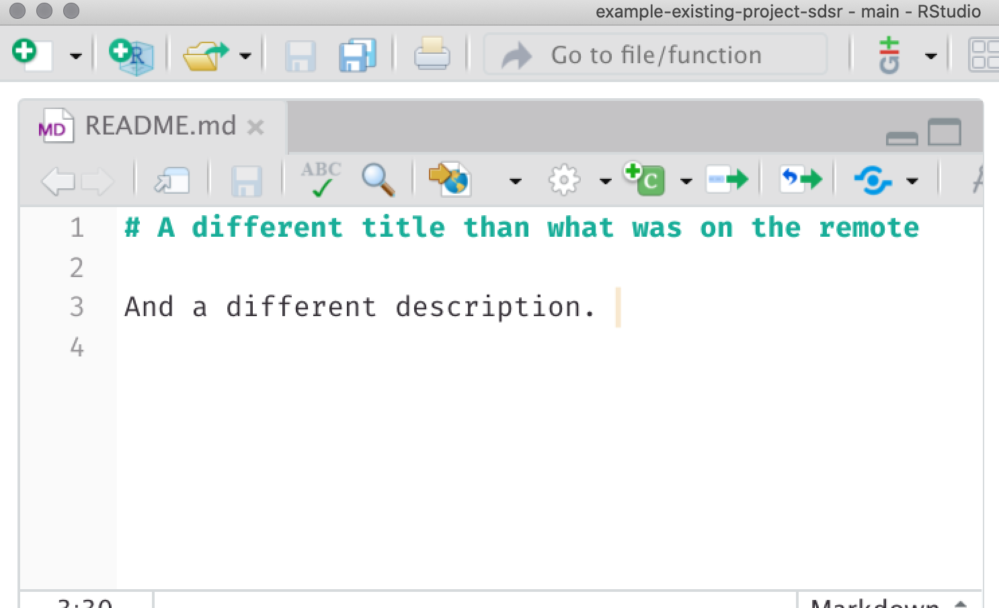

Then we'll move to GitKraken as we normally would and stage the file (preparing to commit). Notice the diff shows the difference between our file and the previous verion *on our local repo*, which is different from the remote, because we forgot to pull first.

Not pictured in the above is that, before staging, had we first looked at our commits, we would have seen that our local was behind our remote. Regardless, in some cases, it might actually be worth creating a merge conflict intentionally and then decide what to keep (particularly because GitKraken has such a nice interface for dealing with merge conflicts).

Assuming that we were  oblivious to the commits shown in GitKraken (and that we were behind the remote) we might try to just push our changes. In this case, we would get a message telling us our local was behind the remote. It would then ask us what we would like to do. 

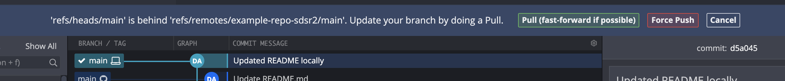

Generally, at this point we should either cancel, or "Pull (fast-forward if possible)". The former will allow us to go back where we were, and even undo our commit. Using GitKraken it is very simple to undo commits *that have not been pushed to the remote*; you just click the "undo" button along the top. Things become more complicated once the commits have been pushed to the remote. Undoing commits at that point is still possible, but less straightforward (and will not be covered here; see however, [here](https://stackoverflow.com/questions/22682870/git-undo-pushed-commits)). Except in rare circumstances, you should almost *always* avoid using "Force Push". While this may work, it is destructive and can erase the previous commits (indeed, it's part of how you delete a commit after pushing). Pull fast-forward will pull the most recent changes, try to merge them in with your changes and, if successful, push all changes to the remote. This is generally a fairly safe option, although it is *more* safe to simply cancel and do the pull on your own first.

In this case, I tried "Pull (fast-forward if possible)" but, because I had made edits to a line that had already been edited, the automatic merge failed, which looked like the below.

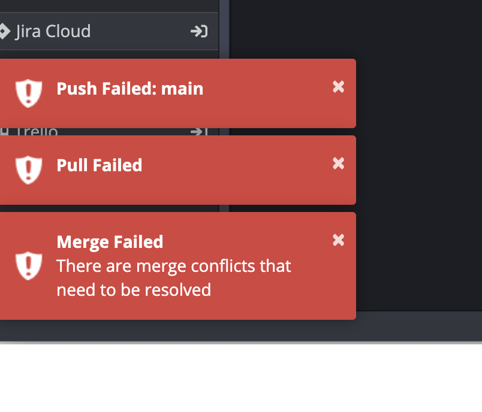

So I have not actually pushed anything to the remote yet, because I have to resolve the merge conflict manually. My GitKraken windows now look like the below

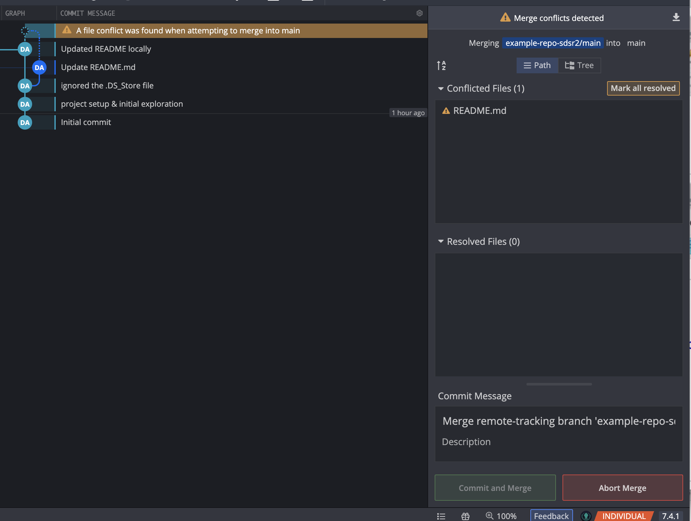

At this point, I just have to click on the file in the "Conflicted Files" pane and I will enter GitKraken's merge conflict editor. 

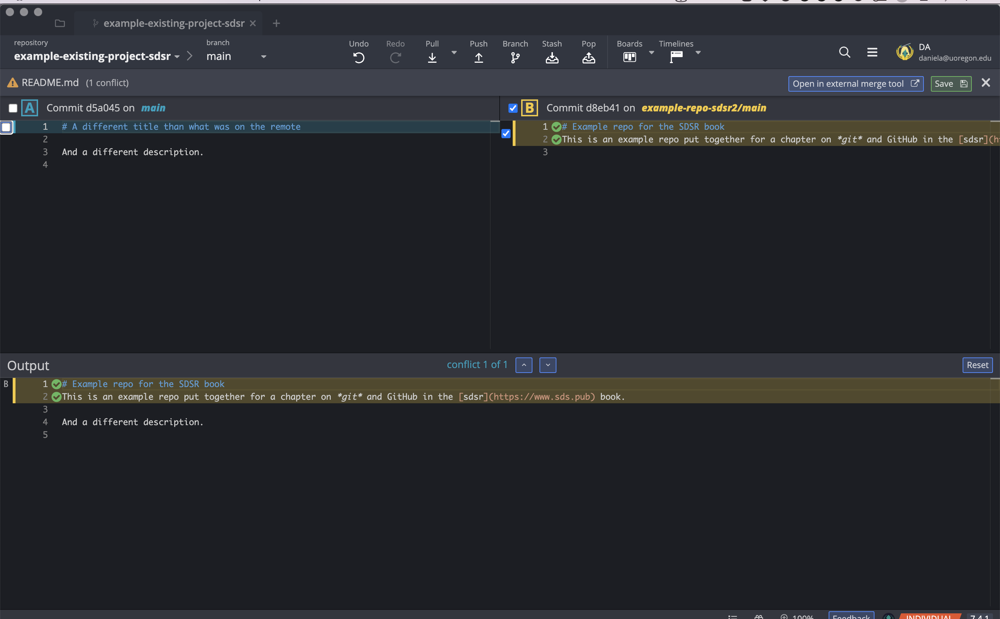

The top portion of the above shows the two files, with the left pane showing (in this case) my local file and the right pane showing the file from the remote. I can click which file I want to keep, and I get a preview below. In this case, I've chosen to stick with what was on the remote. In the preview below, however, you see that part of the "A" file (from my local commit) shows in the preview ("And a different description"). This is because we asked *git* to merge automatically for us if it could. Line 3 on my local had changed, but this did not conflict with anything on the remote, so that change was merged in. This is an important distinction. *Merge conflicts deal with conflicting lines of a file, not the file itself*. If you ask the file to merge automatically, it will merge whatever it can and leave you to deal with what cannot be merged automatically, which may or may not be what you want. You could, of course, always edit the file again after dealing with the merge conflict.

After we have selected the lines we'd like to keep (including potentially both sets of changes) you click "Save" near the top right and the file is automatically staged.

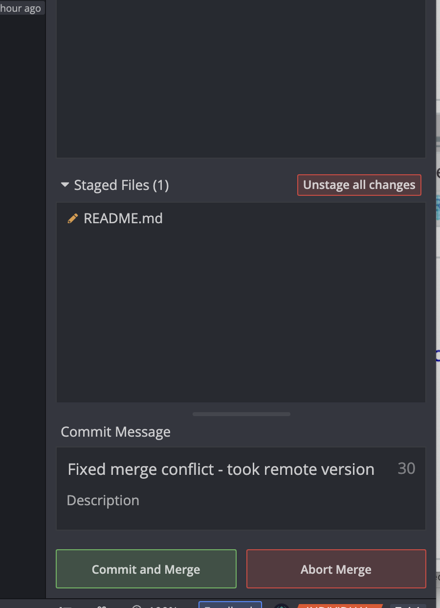

A pre-slugged commit message is also provided, which I have changed in the above to be a bit more specific. Once you have resolved and committed the merge conflict, you can again push to the remote.

Notice in the above that it looks like separate tracks or branches right around the merge conflict. We'll talk about branching (among other topics) in the next section.

## Collaborating

One of the strengths of using *git* is that it provides an efficient means of collaborating. However, not just anyone can contribute to your repo directly. There are two primary ways you can collaborate on a repo with colleagues: (a) add collaborators to an existing repo, or (b) create an organization and add collaborators to specific repos, or the organization as a whole. The primary difference between these is that organizations typically have many repos, and you can grant access to all repos simultaneously. You might consider creating an organization for your entire lab, for example, and then have different repos for different projects. Even within organizations, however, you can add collaborators to individual repos without providing access to the entire organization.

To add collaborators to a repository, go to Settings -> Manage Access -> Invite a collaborator

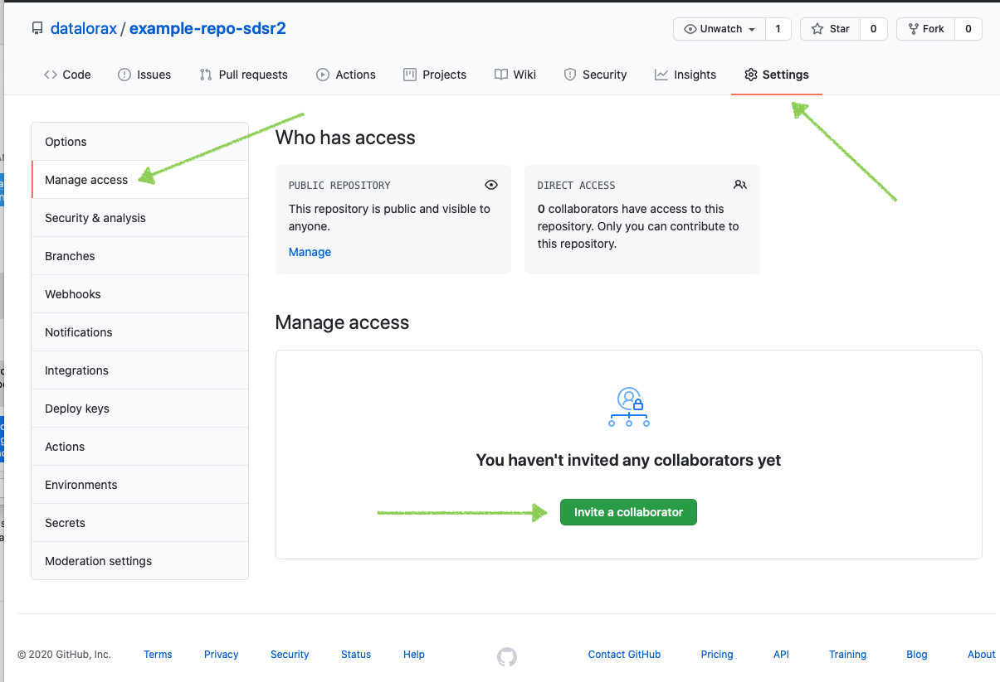

You can then search for individuals by their GitHub username, email, or their first/last name. Once an invite is sent, the individual must accept the invite and they will then have push access to the repo. Collaborators should generally be reserved for people who have ongoing roles in the project, with direct contributions. Small bug fixes, etc., can be handled with repository forks (described below).

### Branching

Branching is a really powerful framework for working with *git*, and one we suggest you become comfortable with as early as possible. When you create a branch, you effectively create a parallel copy of the entire repo. You can make any changes you want on that branch and be assured that you will not break anything on the main branch because it is completely separate. Once you've built out whatever it is you were working on in your branch, and you have decided with your collaborators that it should be part of the main branch, you can merge it in. Alternatively, you may decide you don't want to actually make those changes, and then you can just trash the branch and move on without any disruption to the main branch.

As a general rule, you should try to never make changes directly to the main branch. Instead, create branches, make changes there, and then merge them in. This helps ensure changes are implemented into the main branch in a planful way, and you can use review systems with your colleagues to ensure everyone is on the same page.

To create a branch in GitKraken, you right click on the most recent commit and select "Create branch here". 

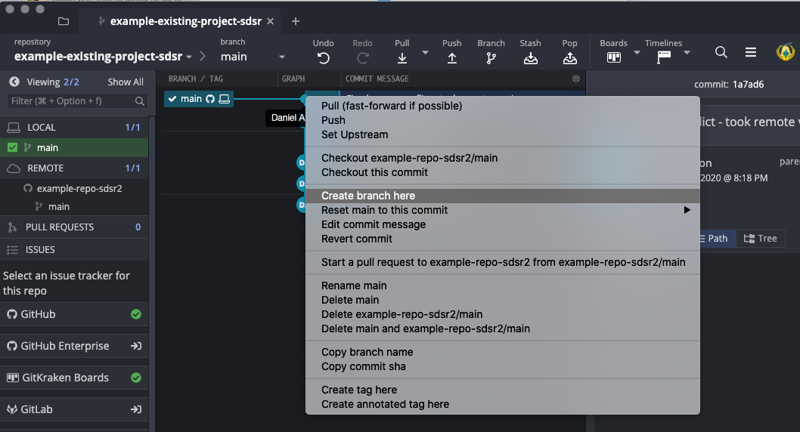

It will then prompt you to provide the branch with a new name. Here we'll use "example-branch". As soon as you provide the name, GitKraken will automatically *checkout* the branch for you. In the below, notice that the green check mark is next to `example-branch` and not `main`. If we were to double click `main`, we would checkout the main branch instead, but at present they are the identical.

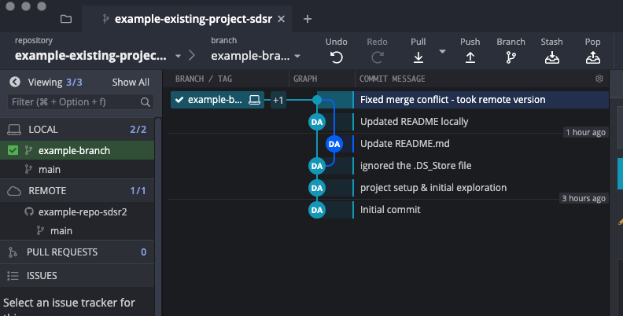

Let's now go make some changes in our repo. In this case, I've made some edits to the script file which produces the plot, and re-saved the plot. Let's look at the diff.

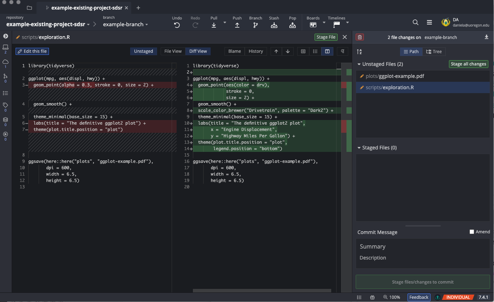

In the above we can see that I added a new line after loading the **{tidyverse}**, changed the points so they are colored according to `drv` and removed the transparency, `alpha`. I've also added a line to change the default colors for the points, added labels, placed the plot legend at the bottom, and changed the styling of the code a bit (mostly additional line breaks). You can see that some of the text was already existing, but is now on a new line (e.g., line 13 of the new file) while other pieces are brand new (e.g., line 24 of the new file). The `ggsave()` code was unchanged.

Next, let's add one additional file to our repo, which will just be the default Rmd template. We'll save and render this file in a new folder we're calling "reports". GitKraken now looks like the below, with two new files added, and Rmd and html file in the `report` directory, and the edited exploration and ggplot-example files.

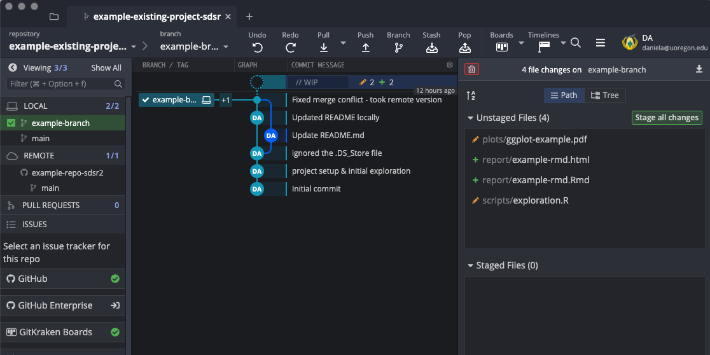

Let's go ahead and stage and commit these files through two commits. First we'll commit the plot changes with the commit message "styled plot", then we'll commit the report with the commit message "created report template". Note that these commits have been made *to the example-branch* branch, and not the main branch. Our *example-branch* is now two commits ahead of our main branch.

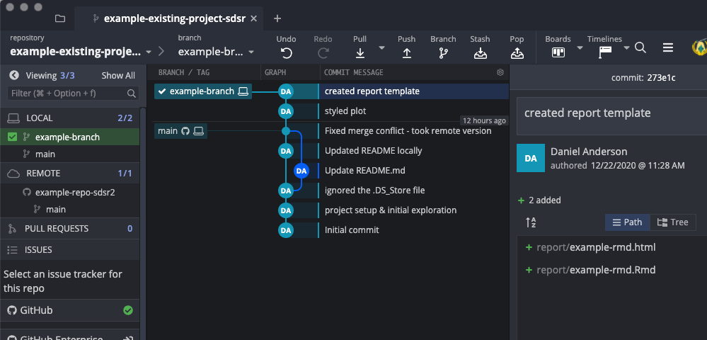

We also still have *example-branch* checked out. Our local folder for the repo currently looks like the below.

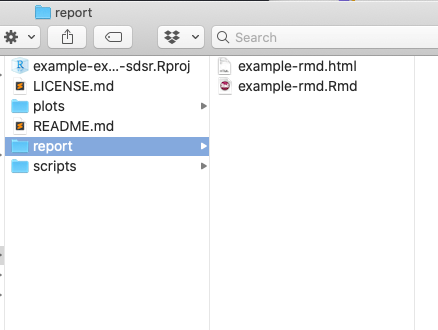

If we go back to GitKraken and double click on "main" on the left side, however, the edits we made to the plot and the report folder overall disappear from our local folder.

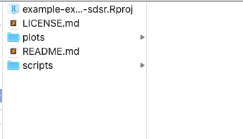

This is because those edits (and commits) were made on *example-branch*, but we are no longer on that branch, so we can't see those changes. 

Let's switch back to *example-branch* and push those changes to the remote. It will ask us what remote branch it should push to. Just leave the default settings, which will be the name of the branch, and click submit. 

#### Pull Requests

After pushing a branch to your remote repository, go to GitHub and you should see something like the below.

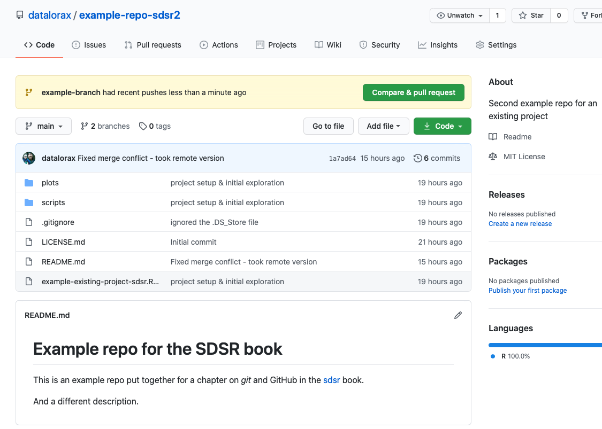

This is noting that a new branch has been created on the remote, and it's asking if you'd like to submit a pull request to compare the changes between this branch and the main branch and (potentially) merge the branch with the main branch. Right below this flagged message, you will also see that we now have 2 branches. You can click on the drop down next to `main` and see the second branch, as well as the repo at that state (i.e., viewing the repo through GitHub as if you have checked out *example-branch*).

Let's go ahead and click "Compare and pull request" to start a pull request. Note that if this flag were not there, you could do the same thing by clicking on "Pull requests" along the top navigation bar (next to Issues), click "New pull request" and then change the drop-down menus so you're comparing "main" to "example-branch", with the latter being merged into the former (i.e., an arrow pointing toward main). If you take this route, it should look like the below. Click "Create pull request" to actually start the pull request to merge *example-branch* into the main branch.

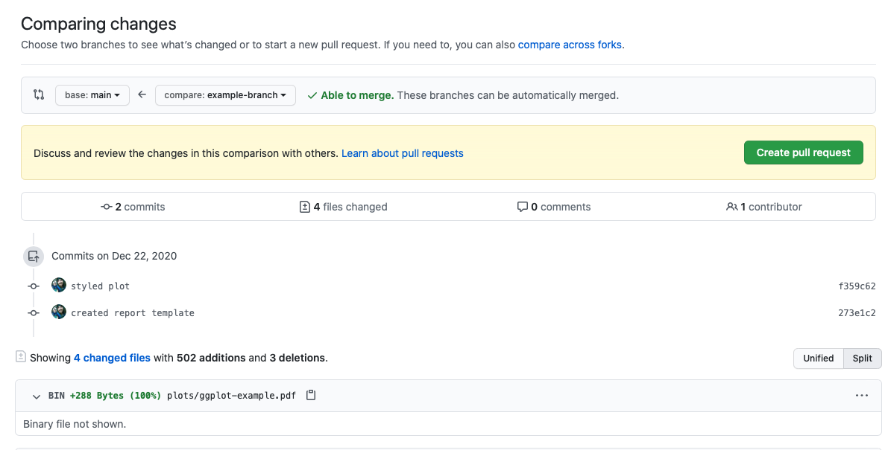

Once you open a pull request (PR), the title will be filled in for you by the commit message, but you can change this if you'd like. Generally, you will want to then leave a comment with a brief description of the enhancement the PR adds or the problem it solves. On the right side, you can also request reviewers for your PR (they must be collaborators on the repo). GitHub has a pretty nice system for reviewing code that allows you to provide comments to specific lines. You can also add labels (e.g., "Bug", "Enhancement") or assignments (although these are more common for Issues than PRs). You can also choose to *link* to an Issue, which will cause the issue to automatically close once the PR has been merged.

In the below, I've created the PR with a very basic description and added the *enhancement* tag. I'm not requesting any reviewers or linking any issues in this case because it's so simple (and I actually never invited any collaborators), but these are generally good things to do as well.

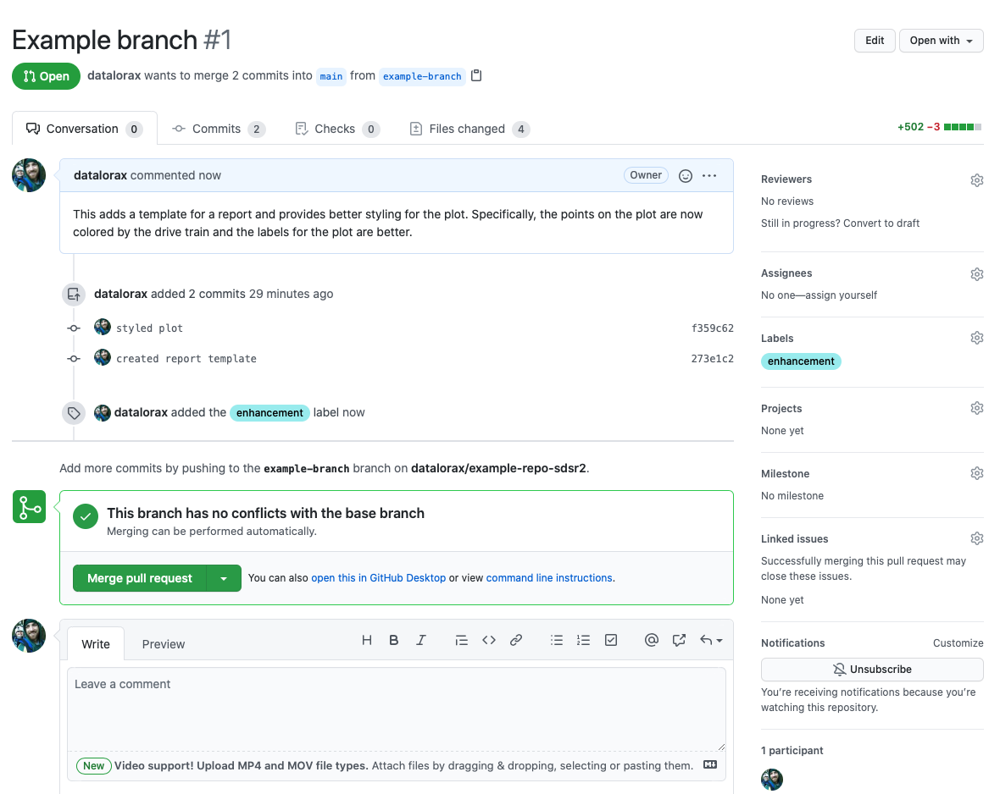

Note that GitHub will do an automatic check to make sure the PR can be merged without any conflicts. If it cannot, I recommend doing the merge locally through GitKraken so you can use the merge conflict editor, then pushing the changes. GitHub will detect if a PR has been merged in a previous commit and close automatically (i.e., after you push the main branch that has the previously conflicted branch merged). Most of the time you will not have conflicts and you can just merge the pull request.

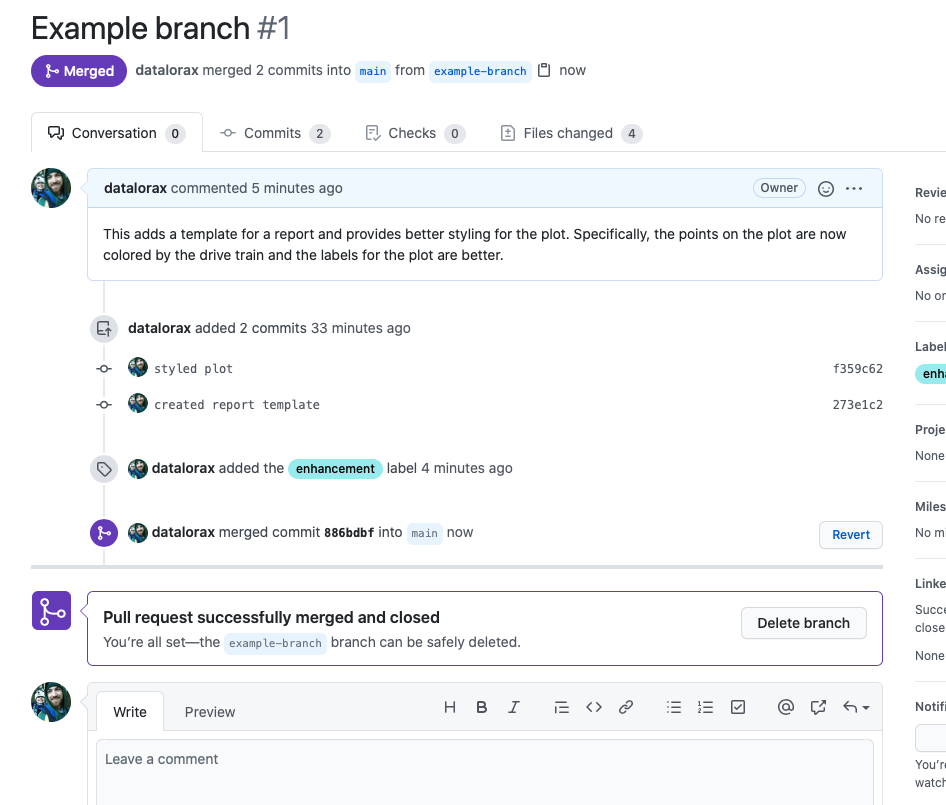

Note that GitHub will immediately ask you if you'd like to delete the branch. Except in rare circumstances, you will nearly always want to delete the branch after merging. This will delete the branch *on the remote*, but not on your local.

If we go back to our local, GitKraken now looks like the below.

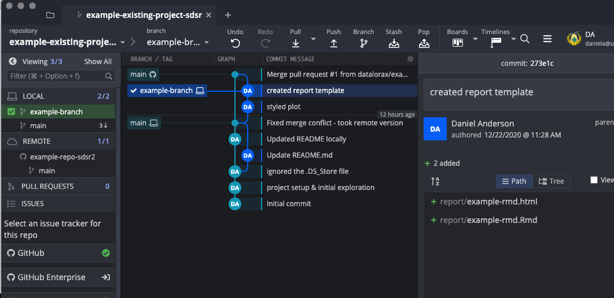

Notice that we still have *example-branch* checked out. Additionally, we can see that the *main* branch on the remote is ahead of *example-branch* on our local (because it's been merged) and it is also ahead of our local main branch.

Let's switch to the main branch (double-click on "main" on the left pane under LOCAL) and pull for the most recent changes.

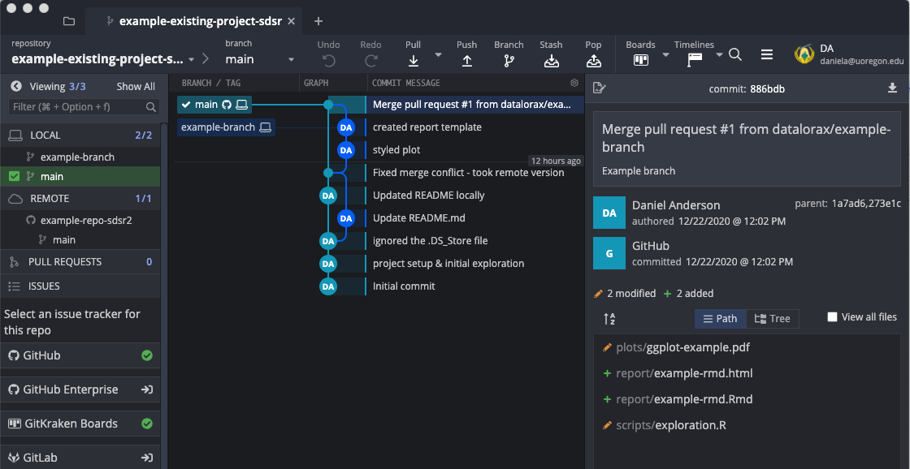

And we can now see that our main branch on our local is up to date with the remote, but the *example-branch* is now behind. At the point, those changes have also been merged in with *main*, and we can safely delete this branch (right click on the branch name with *main* checked out - select "Delete [branch name]").

### Forking

The process described above assumes that you either own the repo or are a direct collaborator on the repo. What happens, however, if you are want to contribute to somebody else's project? For example, maybe you're working with a new R package and you notice a minor bug that would be easy to fix. Rather than filing an issue, you could *fork* the repo to your account, make the changes there, and then submit a pull request while comparing across forks. Note this does not mean you should do this *instead* of filing an issue, and best practice would be to communicate with the package developer ahead of time. You could, for example, file and issue and offer to provide the fix through your fork and a subsequent PR. This is a powerful framework and allows enormous gains in development through crowdsourcing problems. The [**{broom}**](https://github.com/tidymodels/broom/blob/master/DESCRIPTION) package, for example, has three core authors, but contributions from nearly 120 other individuals (at the time of this writing). Beyond contributing to a repo directly, you might choose to fork a repo because you want to make some small change that probably *shouldn't* be implemented in the actual repository, but makes sense to change for your purposes. It's also common to fork things like personal websites, where you use somebody else's website as the basis for developing your own.

To fork a repo, navigate to the repo you want to copy to your account, and click the "fork" button near the top right.

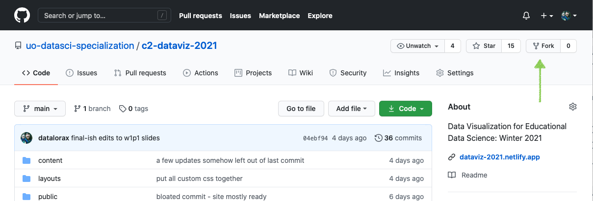

It will then ask you where you want to fork the repo. If you only have one account, you'll just click your account. In my case, I have my individual account, and a few different organizations. I'll fork this repo to my individual account.

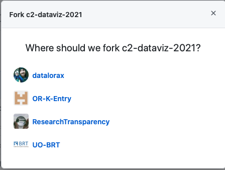

It will then take a few minutes to fork and then you'll have a copy of the repo on your local account. The benefit here is that *you have full access* to this copy. You can make whatever edits you'd like and commit/push them to your fork.

If you'd like to make a pull request from your fork (after you've made some edits that you think should be incorporated into the main repo), you just need to go back to the original repo, click "Pull requests" then "New pull request". Once you get there, it will ask you what branch you want to merge in, just as before. In this case, however, you want to "compare across forks". Select your fork, and you should be able to complete the pull request just as before.

One thing worth noting with forks is that it is very common for your fork to end up behind the main repository. You then need to sync your fork with the upstream repository. This is one of the few operations that I do not know how to handle through GitKraken, but it is relatively straightforward (see [here](https://docs.github.com/en/free-pro-team@latest/github/collaborating-with-issues-and-pull-requests/syncing-a-fork)).  

### Stashing
When you're working across multiple branches, you may find yourself accidentally making changes on one branch that *should* have been made on another branch. You don't want to *commit* those changes, because they should be committed on a different branch that you do not currently have checked out. This is where *stashing* can be helpful. The below is a very simple example where I have a *report* branch but I have accidentally made edits to the report on the *main* branch. Depending on the situation, you may be able to just switch to the *report* branch and make your commits there. Ofen, however, you will need to first *stash* your changes. You do this by first selecting your files in the "Unstaged Files" area, then clicking the "Stash" button at the top (next to "Branch").

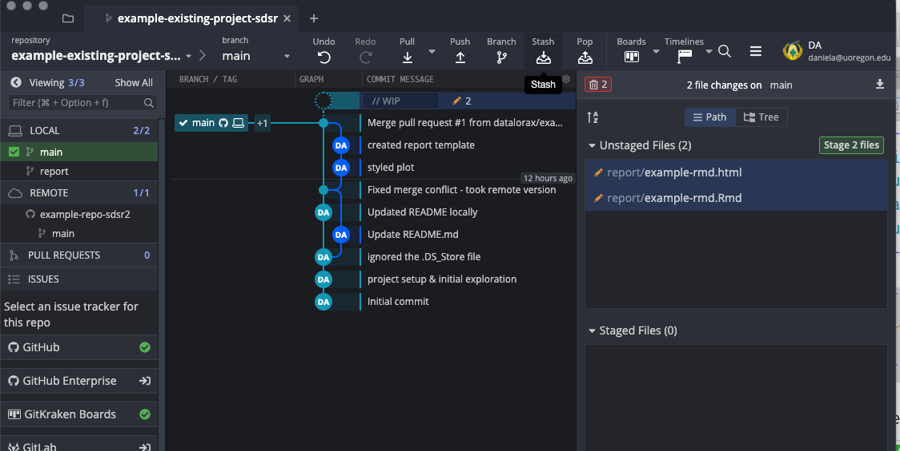

This will place the files in, essentially, a temporary branch, which allows you to then checkout other branches. 

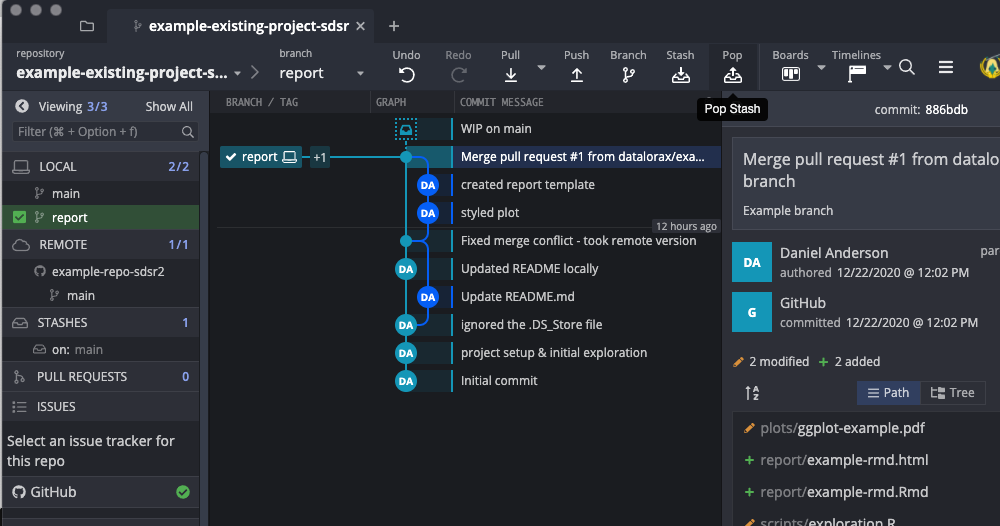

Next, you checkout the branch you want the changes on (*report*) and click "Pop" (next to "Stash").

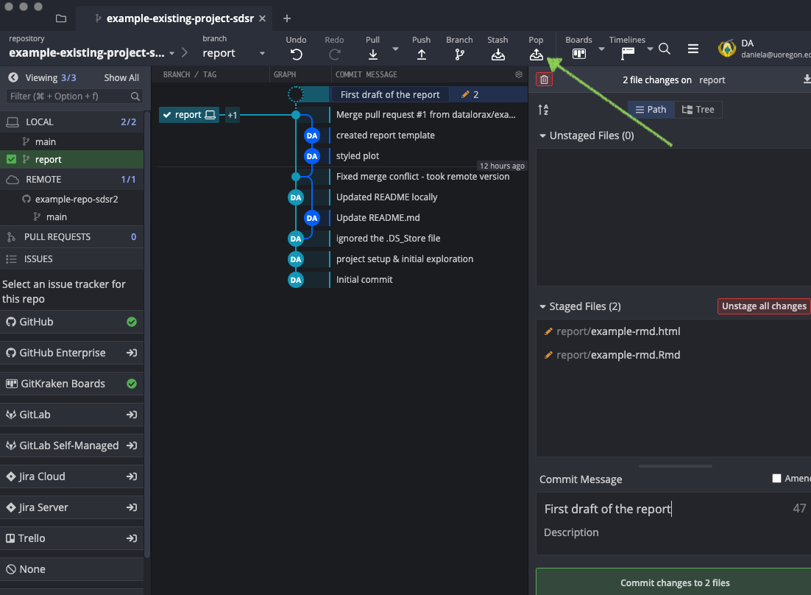

You can then stage and commit the files on that branch, as intended.

Another common area where stashing can com into play is if you have pulled for recent changes *without* having first committed all the changes you've made locally. In this case the stash will be created automatically (but will look similar to the screenshot above), but you can pop it on the branch you'd like in the same way. Note that stashes do not prevent merge conflicts and it is fairly common to have a merge conflict between a stash and the branch you are trying to pop it on.

## General workflow advice

Working with *git* with GitHub and GitKraken is extremely powerful. Beyond the collaboration opportunities discussed above, it also helps keep your work more open and transparent. Further, as we'll discuss later in the book, GitHub provides ways of *publishing* your work online (e.g., data dashboards, websites) and numerous applications integrate with GitHub to provide additional services. While not discussed here, [GitHub Actions](https://github.com/features/actions) are also extremely powerful and can automate many operations (e.g., unit testing). However, all of this can also be a bit intimidating when getting started. We recommend the following workflow:

* Create a repo
* Add collaborators
* Always pull before starting new work
* Always commit all changes before finishing your work
* File Issues to track work that should be completed
	- Include assignments for individuals
	- Tag issues to help with organization
* Use branches to create new changes
* Submit pull requests when the work on a given branch is complete, and link it to the corresponding issue
	- Tag collaborators to review the pull request
	- Use GitHub's review resources to comment on individual lines of code, as needed
	- Use the PR to have conversations about the changes and any revisions needed
* Merge pull requests and delete the remote branch
	- Move back your local, checkout the main branch, pull the merged changes, delete the local branch

The above should help avoid merge conflicts, but it is still important to stay in communication with your collaborators so you don't end up out of sync.

